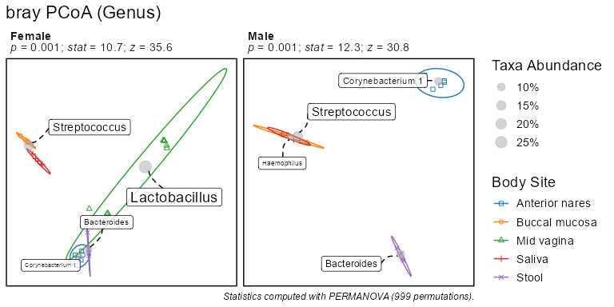
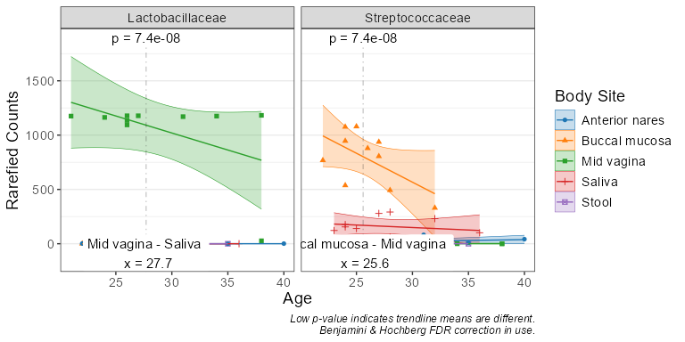
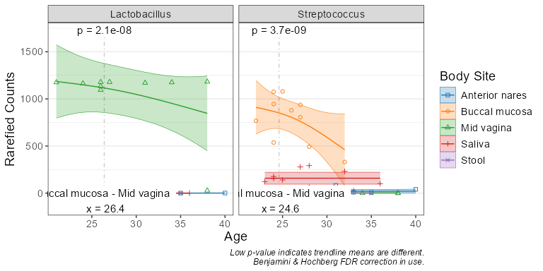
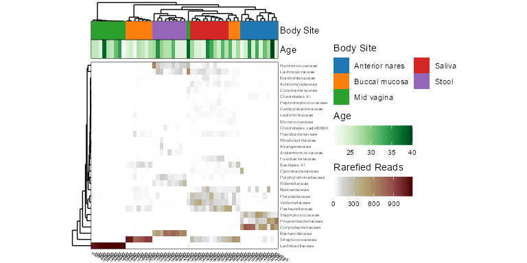
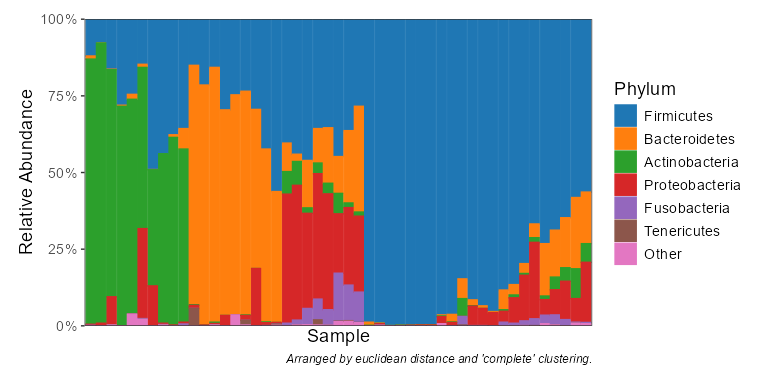

<!-- Run `devtools::build_readme(); pkgdown::build_home()` after editing.  -->

# rbiom

<!-- badges: start -->

[](https://CRAN.R-project.org/package=rbiom)
[](https://anaconda.org/conda-forge/r-rbiom)
[](https://cranlogs.r-pkg.org/)
[](https://github.com/cmmr/rbiom/actions/workflows/R-CMD-check.yaml)
[](https://app.codecov.io/gh/cmmr/rbiom)
<!-- badges: end -->

This package is a toolkit for working with Biological Observation Matrix
(BIOM) files. Features include reading/writing all ‘BIOM’ formats,
rarefaction, alpha diversity, beta diversity (including ‘UniFrac’),
summarizing counts by taxonomic level, subsetting, visualizations, and
statistical analysis. All CPU intensive operations are written in C.

Reference material is available online at
<https://cmmr.github.io/rbiom/index.html>

Source code can be found at <https://github.com/cmmr/rbiom>

## Installation

The latest stable version can be installed from CRAN.

``` r
install.packages("pak")
pak::pak("rbiom")
```

The development version is available on GitHub.

``` r
pak::pak("cmmr/rbiom")
```

## Usage

#### Import and rarefy abundance counts.

``` r
library(rbiom)

infile <- system.file(package = "rbiom", "extdata", "hmp50.bz2")
biom   <- rarefy(infile)
```

#### Explore associations with metadata.

``` r
bdiv_ord_plot(biom, stat.by = "Body Site", facet.by = "Sex")
```

<!-- -->

``` r
adiv_boxplot(biom, x = "Sex", adiv = c("otu", "shan"), stat.by = "Body Site")
```

<!-- -->

``` r
subset(biom, `Body Site` == 'Buccal mucosa') %>% 
  taxa_corrplot("Age", taxa = 2, layers = 'ptc', fit = 'lm', test = 'emtrends')
```

<!-- -->

#### Summarize counts by taxonomic rank.

``` r
taxa_heatmap(biom, taxa = 10, tracks = c("body", "age"))
```

<!-- -->

``` r
taxa_stacked(biom, rank = "Phylum")
```

<!-- -->

``` r
taxa_table(biom, 'Phylum')
#> # A tibble: 294 × 8
#>    .rank  .sample .taxa          .abundance   Age   BMI `Body Site`   Sex   
#>    <fct>  <chr>   <fct>               <dbl> <dbl> <dbl> <fct>         <fct> 
#>  1 Phylum HMP01   Firmicutes            856    22    20 Buccal mucosa Female
#>  2 Phylum HMP01   Bacteroidetes         199    22    20 Buccal mucosa Female
#>  3 Phylum HMP01   Actinobacteria         16    22    20 Buccal mucosa Female
#>  4 Phylum HMP01   Proteobacteria         72    22    20 Buccal mucosa Female
#>  5 Phylum HMP01   Fusobacteria           32    22    20 Buccal mucosa Female
#>  6 Phylum HMP01   Tenericutes             0    22    20 Buccal mucosa Female
#>  7 Phylum HMP02   Firmicutes            803    24    23 Buccal mucosa Male  
#>  8 Phylum HMP02   Bacteroidetes         192    24    23 Buccal mucosa Male  
#>  9 Phylum HMP02   Actinobacteria         52    24    23 Buccal mucosa Male  
#> 10 Phylum HMP02   Proteobacteria         96    24    23 Buccal mucosa Male  
#> # ℹ 284 more rows
```
