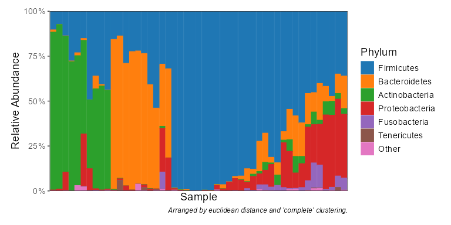

<!-- Run `devtools::build_readme(); pkgdown::build_home()` after editing.  -->

# rbiom

<!-- badges: start -->

[](https://travis-ci.org/cmmr/rbiom)
[](https://cran.r-project.org/package=rbiom)
[](https://anaconda.org/conda-forge/r-rbiom)
<!-- badges: end -->

This package is a toolkit for working with Biological Observation Matrix
(BIOM) files. Features include reading/writing all ‘BIOM’ formats,
rarefaction, alpha diversity, beta diversity (including ‘UniFrac’),
summarizing counts by taxonomic level, subsetting, visualizations, and
statistical analysis. All CPU intensive operations are written in C.

Reference material is available online at
<https://cmmr.github.io/rbiom/index.html>

Source code can be found at <https://github.com/cmmr/rbiom>

## Installation

The latest stable version can be installed from CRAN.

``` r
install.packages("rbiom")
```

The development version is available on GitHub.

``` r
install.packages("remotes")
remotes::install_github("cmmr/rbiom")
```

## Usage

#### Import and rarefy abundance counts.

``` r
library(rbiom)

infile <- system.file(package = "rbiom", "extdata", "hmp50.bz2")
biom   <- rarefy(infile)
```

#### Explore associations with metadata.

``` r
bdiv_ord_plot(biom, color.by = "Body Site", facet.by = "Sex")
```

<!-- -->

``` r
adiv_boxplot(biom, x = "Sex", adiv = c("otu", "shan"), color.by = "Body Site")
```

<!-- -->

``` r
taxa_corrplot(biom, x = "Age", layers = "stc", taxa = .01, color.by = "bod")
```

<!-- -->

#### Summarize counts by taxonomic rank.

``` r
taxa_heatmap(biom, taxa = 30, color.by = c("body", "age"), limit.by = c(sex = "Male"))
```

<!-- -->

``` r
taxa_stacked(biom, rank = "Phylum")
```

<!-- -->

``` r
taxa_table(biom, 'Phylum')
#> # A tibble: 637 × 8
#>    .rank  .sample .taxa               .abundance   Age   BMI `Body Site`   Sex  
#>    <fct>  <chr>   <fct>                    <dbl> <dbl> <dbl> <fct>         <fct>
#>  1 Phylum HMP01   Actinobacteria              13    22    20 Buccal mucosa Fema…
#>  2 Phylum HMP01   Bacteroidetes              192    22    20 Buccal mucosa Fema…
#>  3 Phylum HMP01   Cyanobacteria                0    22    20 Buccal mucosa Fema…
#>  4 Phylum HMP01   Deinococcus Thermus          0    22    20 Buccal mucosa Fema…
#>  5 Phylum HMP01   Firmicutes                 854    22    20 Buccal mucosa Fema…
#>  6 Phylum HMP01   Fusobacteria                37    22    20 Buccal mucosa Fema…
#>  7 Phylum HMP01   Gracilibacteria             13    22    20 Buccal mucosa Fema…
#>  8 Phylum HMP01   Proteobacteria              74    22    20 Buccal mucosa Fema…
#>  9 Phylum HMP01   Saccharibacteria             0    22    20 Buccal mucosa Fema…
#> 10 Phylum HMP01   Spirochaetae                 0    22    20 Buccal mucosa Fema…
#> # ℹ 627 more rows
```

## Parallel Processing

Computation of beta diversity metrics (UniFrac, Bray-Curtis, etc) will
use all available CPU cores by default. To limit the number of cores
used, you can set the numThreads option:

``` r
RcppParallel::setThreadOptions(numThreads = 4)
```

## Building from source

rbiom requires the following system libraries which can be installed
through your operating system’s package manager.

- deb (Debian, Ubuntu):
  `libudunits2-dev libssl-dev libxml2-dev libcurl4-openssl-dev libgdal-dev`
- rpm (Fedora, CentOS, RHEL):
  `udunits2-devel openssl-devel libxml2-devel libcurl-devel gdal-devel`
- csw (Solaris): `libssl_dev openssl@1.1 libxml2_dev gdal_dev`
- brew (OSX): `udunits`
