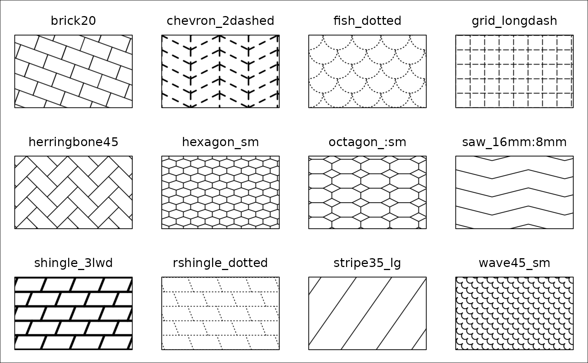
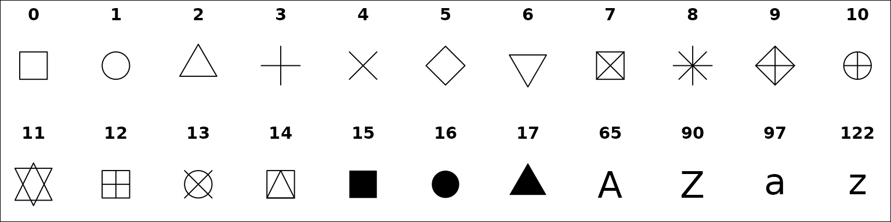
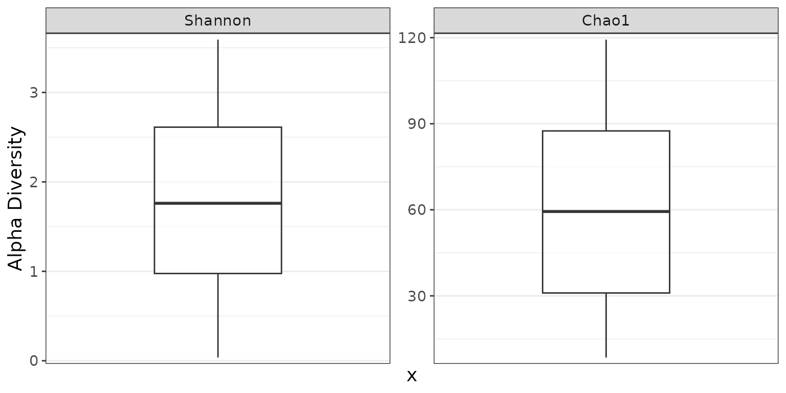

# Mapping Metadata to Aesthetics

## Colors

### Automatic colors

All `stat.by` needs is the name of the metadata field you’d like to
color by. In these cases, rbiom will select an appropriate palette to
use.

``` r
stat.by = "Sex"
```

### Custom colors

You can map your metadata values to any color you’d like using the
syntax in the following examples. You can use hexadecimal codes or any
of the 657 named R
[`colors()`](https://rdrr.io/r/grDevices/colors.html).

``` r
stat.by = "Sex", colors = c("cyan", "#FFC83D")
stat.by = "Sex", colors = c('Male' = "cyan", 'Female' = "#FFC83D")
```

### Built-in palettes

A collection of color-blind friendly palettes are pre-defined in rbiom.
They have been compiled from multiple sources:

- Crameri, Fabio (2023). *Scientific colour maps*.
  [website](https://www.fabiocrameri.ch/colourmaps/)  
  [doi](https://doi.org/10.5281/zenodo.8409685)
- Frerebeau, Nicolas (2023). *khroma: Colour Schemes for Scientific Data
  Visualization*. [website](https://packages.tesselle.org/khroma/)  
  [doi](https://doi.org/10.5281/zenodo.1472077)
- Neuwirth, Erich (2022). *ColorBrewer Palettes*.
  [website](http://colorbrewer2.org)
- Okabe, Masataka, and Ito, Key (2008). *Color Universal Design (CUD):
  How to Make Figures and Presentations That Are Friendly to Colorblind
  People*. [website](https://jfly.uni-koeln.de/color/)
- Tol, Paul (2021). *Colour Schemes*.
  [pdf](https://personal.sron.nl/~pault/data/colourschemes.pdf)

``` r
# Most plots assign colors from a single categorical metadata field.
stat.by = "Body Site", colors = "bright"

# Heatmap plots allow multiple metadata fields of any type.
color.by = c('Body Site' = "okabe", 'Age' = "bamako")
```

#### Discrete palettes

|            |                                      |           |                            |
|-----------:|--------------------------------------|----------:|----------------------------|
|     bright | ███████                              |   tableau | ██████████                 |
|    vibrant | ███████                              |   classic | ██████████                 |
|      okabe | ████████                             |     carto | ████████████               |
|         r4 | ████████                             |       tol | ████████████               |
|      light | ████████                             | tableau20 | ████████████████████       |
|      muted | █████████                            |     kelly | █████████████████████      |
|      fishy | █████████                            |  alphabet | ██████████████████████████ |
| polychrome | ████████████████████████████████████ |           |                            |

#### Continuous palettes

|        |           |         |           |         |           |
|-------:|-----------|--------:|-----------|--------:|-----------|
|  acton | █████████ |   devon | █████████ |    oslo | █████████ |
|    bam | █████████ |   grays | █████████ | purples | █████████ |
| bamako | █████████ |  greens | █████████ |    reds | █████████ |
| batlow | █████████ |  hawaii | █████████ |    roma | █████████ |
| berlin | █████████ |   imola | █████████ |  tofino | █████████ |
| bilbao | █████████ | lajolla | █████████ |   tokyo | █████████ |
|   broc | █████████ |   lapaz | █████████ |   turku | █████████ |
|   buda | █████████ |  lisbon | █████████ |  vanimo | █████████ |
|   cork | █████████ |    nuuk | █████████ |     vik | █████████ |
|  davos | █████████ | oranges | █████████ |         |           |

#### Reversing a palette

Prefix a palette name with a dash (`-`) to reverse the color order. This
is also helpful for assigning colors to a heatmap’s main grid.

``` r
color.by = c('Age' = "-bamako")
grid = "-imola"
```

## Patterns

Options are `"brick"`, `"chevron"`, `"fish"`, `"grid"`, `"herringbone"`,
`"hexagon"`, `"octagon"`, `"rain"`, `"saw"`, `"shingle"`, `"rshingle"`,
`"stripe"`, and `"wave"`.


Pattern names can optionally be suffixed with modifiers to change the
line width/style, tile size/rotation, and more.



You can allow rbiom to choose a set of patterns, or you can explicitly
define the mappings.

``` r
stat.by = "Body Site", patterns = TRUE
stat.by = "Sex", patterns = c("brick", "stripe35_lg")
stat.by = "Sex", patterns = c('Male' = "brick20", 'Female' = "shingle")
```

See
[fillpattern](https://cmmr.github.io/fillpattern/reference/fill_pattern.html#pattern-names)
for more complete documentation of pattern options.

## Shapes

Shapes can be given as per base R - numbers 0 through 17 for various
shapes, or the decimal value of an ascii character, e.g. 65:90 = A-Z;
97:122 = a-z to use letters instead of shapes on the plot. Text strings
may used as well.

``` r
# One categorical metadata field may be specified.
stat.by = "Body Site"
stat.by = "Sex", shapes = c(7, 8)
stat.by = "Sex", shapes = c('Stool' = 7, 'Saliva' = 8)
```



## Facets

Faceting allows you to split your dataset into multiple sub-plots by one
or more categorical metadata fields. For example:

``` r
biom <- rarefy(hmp50)

adiv_boxplot(biom, stat.by = "Body Site", facet.by = "Sex")
```


``` r
adiv_boxplot(biom, stat.by = "Sex", facet.by = "Body Site")
```


### Auto-generated facets

Plotting functions often allow you to specify multiple ranks, taxa,
metrics, etc which are automatically assigned their own facet dimension.
You can still add your own facets to these plots.

``` r
adiv_boxplot(biom, adiv = c("Shannon", "Chao1"))
```



``` r
adiv_boxplot(biom, adiv = c("Shannon", "Chao1"), facet.by = "Sex")
```


