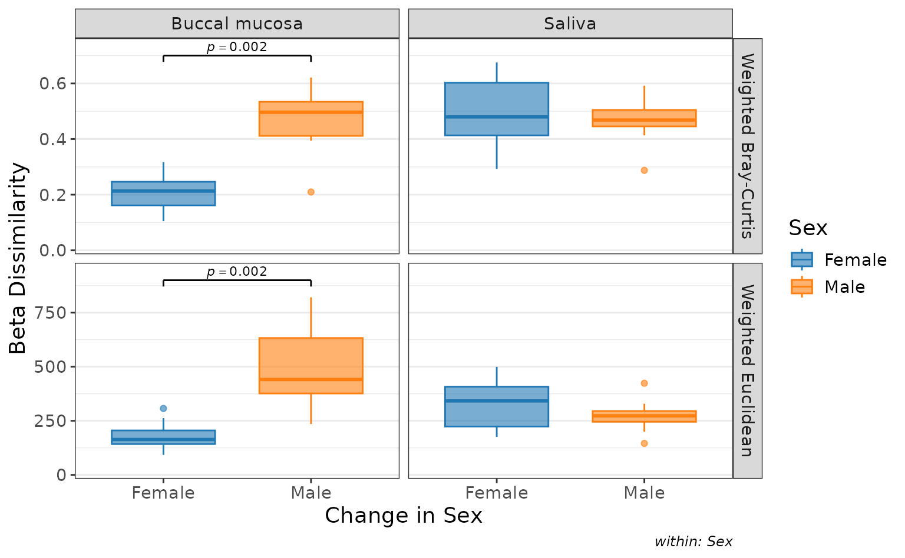

# Plot Types

``` r
biom <- rarefy(hmp50)

bdiv_boxplot(
  biom     = subset(biom, `Body Site` %in% c("Buccal mucosa", "Saliva")), 
  x        = "==Sex", 
  bdiv     = c("Bray-Curtis", "Euclidean"), 
  facet.by = "==Body Site" )
```


