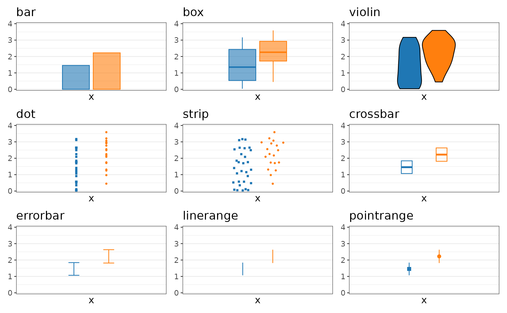
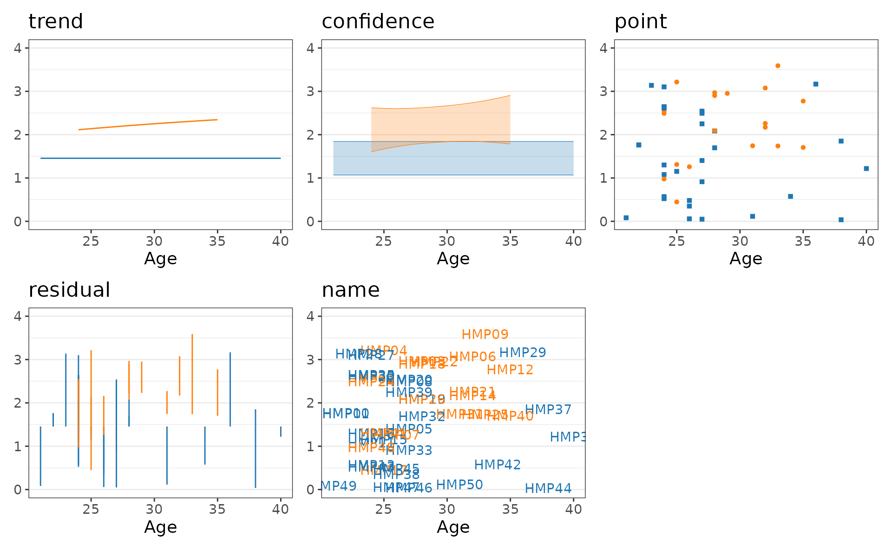
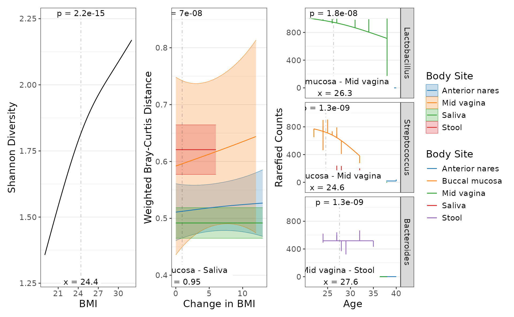
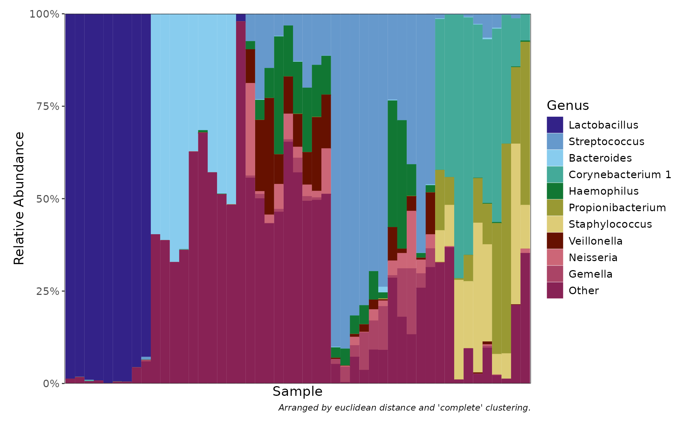

# Plot Types

Plotting functions in rbiom fall into five categories:

| Category          | Functions                                                                                                                                                                                                                              |
|-------------------|----------------------------------------------------------------------------------------------------------------------------------------------------------------------------------------------------------------------------------------|
| Box Plots         | [`adiv_boxplot()`](https://cmmr.github.io/rbiom/reference/adiv_boxplot.md) [`bdiv_boxplot()`](https://cmmr.github.io/rbiom/reference/bdiv_boxplot.md) [`taxa_boxplot()`](https://cmmr.github.io/rbiom/reference/taxa_boxplot.md)       |
| Correlation Plots | [`adiv_corrplot()`](https://cmmr.github.io/rbiom/reference/adiv_corrplot.md) [`bdiv_corrplot()`](https://cmmr.github.io/rbiom/reference/bdiv_corrplot.md) [`taxa_corrplot()`](https://cmmr.github.io/rbiom/reference/taxa_corrplot.md) |
| Ordination Plots  | [`bdiv_ord_plot()`](https://cmmr.github.io/rbiom/reference/bdiv_ord_plot.md)                                                                                                                                                           |
| Heatmaps          | [`bdiv_heatmap()`](https://cmmr.github.io/rbiom/reference/bdiv_heatmap.md) [`taxa_heatmap()`](https://cmmr.github.io/rbiom/reference/taxa_heatmap.md) [`plot_heatmap()`](https://cmmr.github.io/rbiom/reference/plot_heatmap.md)       |
| Stacked Bar Plots | [`taxa_stacked()`](https://cmmr.github.io/rbiom/reference/taxa_stacked.md)                                                                                                                                                             |

## Box Plots

Box plots are useful for visualizing a numeric outcome against one or
more categorical predictors. The rbiom package provides dedicated
functions for three numeric outcomes:

1.  Alpha Diversity (shannon, simpson, etc) -
    [`adiv_boxplot()`](https://cmmr.github.io/rbiom/reference/adiv_boxplot.md).
2.  Beta Diversity (unifrac, bray-curtis, etc) -
    [`bdiv_boxplot()`](https://cmmr.github.io/rbiom/reference/bdiv_boxplot.md).
3.  Taxa Abundance (phylum, genus, etc) -
    [`taxa_boxplot()`](https://cmmr.github.io/rbiom/reference/taxa_boxplot.md).

You can then map categorical metadata variables to the x-axis, colors,
patterns, shapes, and facets. See [Mapping Metadata to
Aesthetics](https://cmmr.github.io/rbiom/articles/aes.md) for details.

### Layers

Despite being refered to as “box plots”, rbiom’s `*_boxplot()` functions
support a wide range of graphical elements beyond box-and-whisker.

You can assign one or more of the following options to a box plot’s
`layers` parameter.



Unambiguous abbreviations are also accepted. For instance,
`layers = c("box", "dot")` is equivalent to `layers = c("x", "d")` and
`layers = "xd"`. Note that the single letter abbreviation for “box” is
“x” (“bar” is “b”).

### Examples

``` r
biom <- rarefy(hmp50, depth = 1000)

adiv <- adiv_boxplot(
  biom = biom, layers = "bes", x = "Sex", stat.by = "Sex")
  
bdiv <- bdiv_boxplot(
  biom = biom, layers = "xd", x = "==Body Site", stat.by = "Body Site", 
  pt.alpha = 0.2, pt.stroke = 0 )

taxa <- taxa_boxplot(
  biom = biom, layers = "p", x = "Body Site", p.label = 0, taxa = 3, 
  facet.ncol = 1, facet.strip.position = "right" )

patchwork::wrap_plots(
  lapply(list(adiv, bdiv, taxa), function (p) {
    p + 
      ggplot2::labs(x = NULL, caption = NULL) + 
      ggplot2::theme(legend.position = "none") }))
```


### Statistics

The categorical groups defined by `x`, `stat.by`, etc are used to
calculate non-parametric statistics with the Mann-Whitney or
Kruskal-Wallis algorithms. See
[Statistics](https://cmmr.github.io/rbiom/articles/statistics.md) for
details.

## Correlation Plots

Correlation plots are designed to visualize the relationship between a
numeric outcome and a numeric predictor, optionally with additional
categorical predictors. The rbiom package provides dedicated functions
for three numeric outcomes:

1.  Alpha Diversity (shannon, simpson, etc) -
    [`adiv_corrplot()`](https://cmmr.github.io/rbiom/reference/adiv_corrplot.md).
2.  Beta Diversity (unifrac, bray-curtis, etc) -
    [`bdiv_corrplot()`](https://cmmr.github.io/rbiom/reference/bdiv_corrplot.md).
3.  Taxa Abundance (phylum, genus, etc) -
    [`taxa_corrplot()`](https://cmmr.github.io/rbiom/reference/taxa_corrplot.md).

You can then map categorical metadata variables to the x-axis, colors,
and facets. See [Mapping Metadata to
Aesthetics](https://cmmr.github.io/rbiom/articles/aes.md) for details.

### Layers

You can assign one or more of the following options to a correlation
plot’s `layers` parameter.



Unambiguous abbreviations are also accepted. For instance,
`layers = c("trend", "point")` is equivalent to `layers = c("t", "p")`
and `layers = "tp"`.

### Examples

``` r
biom <- rarefy(hmp50, depth = 1000)

adiv <- adiv_corrplot(biom, layers = "ts", x = "BMI")
  
bdiv <- bdiv_corrplot(
  biom = biom, layers = "tc", x = "BMI", stat.by = "==Body Site", 
  limit.by = list("Body Site" = c("Buccal mucosa", "Stool")) )

taxa <- taxa_corrplot(
  biom = biom, layers = "tsr", x = "Age", taxa = 3, stat.by = "Body Site", 
  limit.by = list("Body Site" = c("Mid vagina", "Saliva", "Stool")),
  facet.ncol = 1, facet.strip.position = "right" )

patchwork::wrap_plots(
  guides = "collect",
  lapply(list(adiv, bdiv, taxa), function (p) {
    p + ggplot2::labs(caption = NULL) }))
```



## Ordination Plots

### Layers

You can assign one or more of the following options to a ordination
plot’s `layers` parameter.


Unambiguous abbreviations are also accepted. For instance,
`layers = c("point", "ellipse")` is equivalent to `layers = c("p", "e")`
and `layers = "pe"`.

The layers `c("point", "spider", "ellipse", "name")` apply to samples.
The layers `c("mean", "taxon", "arrow")` apply to the taxa.

### Examples

``` r
biom <- rarefy(hmp50)

p1 <- bdiv_ord_plot(biom, layers = "pse", stat.by = "Body Site") +
        ggplot2::theme(legend.position = "none")

p2 <- bdiv_ord_plot(biom, layers = "emt", stat.by = "Body Site")

patchwork::wrap_plots(p1, p2, guides = "collect")
#> Warning in MASS::cov.trob(data[, vars], wt = weight * nrow(data)): Probable
#> convergence failure
#> Warning in MASS::cov.trob(data[, vars], wt = weight * nrow(data)): Probable
#> convergence failure
```


## Heatmaps

Visualizing a large grid of values is a job for heatmaps. The generic
[`plot_heatmap()`](https://cmmr.github.io/rbiom/reference/plot_heatmap.md)
function accepts any matrix, while the two common use cases below
operate on a biom object.

1.  Beta Diversity (unifrac, bray-curtis, etc) -
    [`bdiv_heatmap()`](https://cmmr.github.io/rbiom/reference/bdiv_heatmap.md).
2.  Taxa Abundance (phylum, genus, etc) -
    [`taxa_heatmap()`](https://cmmr.github.io/rbiom/reference/taxa_heatmap.md).

### Examples

``` r
biom <- rarefy(hmp50)

bdiv <- bdiv_heatmap(biom, tracks = c("Age", "Body Site"), asp = 0.4)
taxa <- taxa_heatmap(biom, tracks = c("Age", "Body Site"), asp = 0.4)

patchwork::wrap_plots(bdiv, taxa, ncol = 1, guides = "collect")
```


## Stacked Bar Plots

Taxa stacked bar plots show the same information as a taxa heatmap. Both
have their own advantages.

### Examples

``` r
taxa_stacked(rarefy(hmp50), taxa = 10)
```


