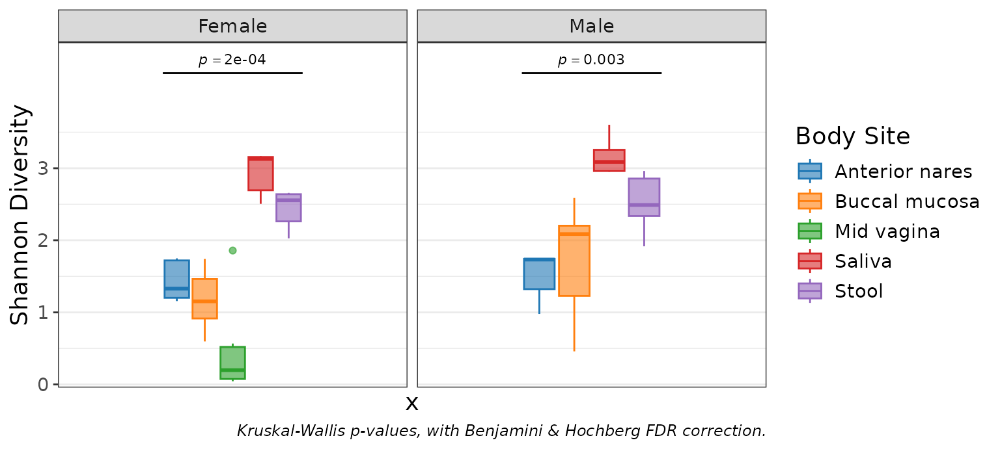

# rbiom

## Create

The general purpose
[`as_rbiom()`](https://cmmr.github.io/rbiom/reference/as_rbiom.md)
function can convert most data types into an [rbiom
object](https://cmmr.github.io/rbiom/reference/rbiom_objects.md) - see
[importing](https://cmmr.github.io/rbiom/articles/importing.md) for
details. Here we’ll import a dataset from a BIOM file.

``` r
library(rbiom)

file <- system.file(package = "rbiom", "extdata", "hmp50.bz2")
biom <- as_rbiom(file)

biom
#> 
#> ══ Human Microbiome Project - 50 Sample Demo ═══════════════
#> 
#> Oral, nasal, vaginal, and fecal samples from a diverse set
#> of healthy volunteers. Source: Human Microbiome Project
#> (<https://hmpdacc.org>).
#> 
#>      50 Samples: HMP01, HMP02, HMP03, ..., and HMP50
#>     490 OTUs:    Unc01yki, Unc53100, LtbAci52, ...
#>       7 Ranks:   .otu, Kingdom, Phylum, ..., and Genus
#>       5 Fields:  .sample, Age, BMI, Body Site, and Sex
#>         Tree:    <present>
#> 
#> ── 182 - 22k reads/sample ──────────────────── 2023-09-22 ──
#> 
```

## Inspect

The rbiom object has many helpful accessors.

| Accessor                 | Content                                                |
|--------------------------|--------------------------------------------------------|
| `$counts`                | Abundance of each OTU in each sample.                  |
| `$metadata`              | Sample mappings to metadata (treatment, patient, etc). |
| `$taxonomy`              | OTU mappings to taxonomic ranks (genus, phylum, etc).  |
| `$otus`, `$n_otus`       | OTU names.                                             |
| `$samples`, `$n_samples` | Sample names.                                          |
| `$fields`, `$n_fields`   | Metadata field names.                                  |
| `$ranks`, `$n_ranks`     | Taxonomic rank names.                                  |
| `$tree`, `$sequences`    | Phylogenetic tree / sequences for the OTUs, or `NULL`. |
| `$id`, `$comment`        | Arbitrary strings for describing the dataset.          |
| `$depth`                 | Rarefaction depth, or `NULL` if unrarefied.            |

``` r
biom$counts[1:4,1:8] %>% as.matrix()
#>          HMP01 HMP02 HMP03 HMP04 HMP05 HMP06 HMP07 HMP08
#> Unc01yki     0     0     0     0     0     0     0     0
#> Unc53100  1083   543   301   223  2672   748  2436   321
#> LtbAci52     0     0     0     0     0     0     0     0
#> CnbTube3     0     0     0     0     0     0     0     0

biom$fields
#> [1] ".sample"   "Age"       "BMI"       "Body Site" "Sex"

# Use pull() to automatically setNames().
pull(biom, 'Age') %>% head()
#> HMP01 HMP02 HMP03 HMP04 HMP05 HMP06 
#>    22    24    28    25    27    32
```

[`pull()`](https://dplyr.tidyverse.org/reference/pull.html),
[`sample_sums()`](https://cmmr.github.io/rbiom/reference/sample_sums.md),
[`taxa_matrix()`](https://cmmr.github.io/rbiom/reference/taxa_matrix.md),
[`taxa_means()`](https://cmmr.github.io/rbiom/reference/taxa_sums.md),
[`taxa_sums()`](https://cmmr.github.io/rbiom/reference/taxa_sums.md)

## Clone

Rbiom objects are ***passed by reference***. The common `<-` assignment
operator creates a second reference to the same object - it does not
create a second object. To create a copy of an rbiom object, use the
object’s `$clone()` method.

``` r
a <- as_rbiom(file)
b <- a$clone()  # Correct

a$n_samples
#> [1] 50
b$metadata %<>% head()
#> Warning: ℹ Dropping 44 samples from biom object since they are not in the new metadata:
#>   "HMP07", "HMP08", "HMP09", "HMP10", "HMP11", "HMP12", "HMP13", "HMP14",
#>   "HMP15", "HMP16", "HMP17", "HMP18", "HMP19", "HMP20", "HMP21", "HMP22",
#>   "HMP23", "HMP24", …, "HMP49", and "HMP50".
a$n_samples
#> [1] 50
```

``` r
a <- as_rbiom(file)
b <- a  # Wrong

a$n_samples
#> [1] 50
b$metadata %<>% head()
#> Warning: ℹ Dropping 44 samples from biom object since they are not in the new metadata:
#>   "HMP07", "HMP08", "HMP09", "HMP10", "HMP11", "HMP12", "HMP13", "HMP14",
#>   "HMP15", "HMP16", "HMP17", "HMP18", "HMP19", "HMP20", "HMP21", "HMP22",
#>   "HMP23", "HMP24", …, "HMP49", and "HMP50".
a$n_samples
#> [1] 6
```

## Modify

There are seven components of an rbiom object which you can modify
directly. Assigning new values to these components will trigger
validation checks and inter-component OTU/sample synchronization. See
[Working with rbiom
Objects](https://cmmr.github.io/rbiom/reference/rbiom_objects.md) for
additional details.

| Component    | What can be assigned.                                  |
|--------------|--------------------------------------------------------|
| `$counts`    | matrix of abundances; OTUs (rows) by samples (columns) |
| `$metadata`  | data.frame with `'.sample'` as the first column        |
| `$taxonomy`  | data.frame with `'.otu'` as the first column           |
| `$tree`      | phylo object with the phylogenetic tree for OTUs       |
| `$sequences` | character vector of reference sequences for OTUs       |
| `$id`        | string with a title for the dataset                    |
| `$comment`   | string with additional dataset information             |

### Rarefy Counts

A common way to normalize microbiome count data is to rarefy it. This
process drops samples with too few observations, and randomly removes
observations from the remaining samples, so that all samples have the
same “rarefaction depth”.

``` r
sample_sums(biom) %>% head()
#> HMP01 HMP02 HMP03 HMP04 HMP05 HMP06 
#>  1660  1371  1353  1895  3939  4150

biom <- rarefy(biom)

sample_sums(biom) %>% head()
#> HMP01 HMP02 HMP03 HMP04 HMP05 HMP06 
#>  1183  1183  1183  1183  1183  1183
```

### Add Metadata

Additional sample metadata columns can be added to `biom$metadata` (a
tibble data.frame). The first column, `'.sample'`, is used by rbiom to
link sample metadata to samples in the abundance table.

``` r
biom$metadata$group <- sample(c('A', 'B'), biom$n_samples, TRUE)
biom %<>% mutate(Obese = BMI >= 30, Sex = NULL)
biom %<>% rename('Years Old' = "Age")
biom$metadata
#> # A tibble: 49 × 6
#>   .sample `Years Old`   BMI `Body Site`   group Obese
#> * <chr>         <dbl> <dbl> <fct>         <fct> <lgl>
#> 1 HMP01            22    20 Buccal mucosa A     FALSE
#> 2 HMP02            24    23 Buccal mucosa A     FALSE
#> 3 HMP03            28    26 Saliva        B     FALSE
#> 4 HMP04            25    23 Saliva        A     FALSE
#> 5 HMP05            27    24 Buccal mucosa A     FALSE
#> # ℹ 44 more rows
```

[`mutate()`](https://dplyr.tidyverse.org/reference/mutate.html),
[`rename()`](https://dplyr.tidyverse.org/reference/rename.html)

### Subset Samples

Removing samples from the metadata will remove those samples from the
entire rbiom object.

``` r
biom %<>% subset(`Body Site` == "Anterior nares")
biom$metadata
#> # A tibble: 10 × 6
#>   .sample `Years Old`   BMI `Body Site`    group Obese
#> * <chr>         <dbl> <dbl> <fct>          <fct> <lgl>
#> 1 HMP10            22    20 Anterior nares B     FALSE
#> 2 HMP15            25    21 Anterior nares A     FALSE
#> 3 HMP16            24    19 Anterior nares B     FALSE
#> 4 HMP25            33    32 Anterior nares A     TRUE 
#> 5 HMP31            31    20 Anterior nares A     FALSE
#> # ℹ 5 more rows
biom
#> 
#> ══ Human Microbiome Project - 50 Sample Demo ═══════════════
#> 
#> Oral, nasal, vaginal, and fecal samples from a diverse set
#> of healthy volunteers. Source: Human Microbiome Project
#> (<https://hmpdacc.org>).
#> 
#>      10 Samples: HMP10, HMP15, HMP16, ..., and HMP48
#>     135 OTUs:    Unc01yki, Unc53100, LtbAci52, ...
#>       7 Ranks:   .otu, Kingdom, Phylum, ..., and Genus
#>       6 Fields:  .sample, Years Old, BMI, ..., and Obese
#>         Tree:    <present>
#> 
#> ── 1183 reads/sample ───────────────────────── 2023-09-22 ──
#> 
```

[`subset()`](https://cmmr.github.io/rbiom/reference/subset.md),
[`slice()`](https://dplyr.tidyverse.org/reference/slice.html)

## Compute

Functions that end in `_table` or `_matrix` return calculation results
for use outside of rbiom. The `_table` suffix indicates the returned
object will be a tibble data.frame with one computed value per row.
Alternatively, `_matrix` will return a base R matrix.

``` r
taxa_table(biom, rank = "Phylum")
#> # A tibble: 60 × 9
#>   .rank  .sample .taxa      .abundance `Years Old`   BMI `Body Site` group Obese
#>   <fct>  <chr>   <fct>           <dbl>       <dbl> <dbl> <fct>       <fct> <lgl>
#> 1 Phylum HMP10   Actinobac…        724          22    20 Anterior n… B     FALSE
#> 2 Phylum HMP10   Firmicutes        446          22    20 Anterior n… B     FALSE
#> 3 Phylum HMP10   Proteobac…          3          22    20 Anterior n… B     FALSE
#> 4 Phylum HMP10   Bacteroid…         10          22    20 Anterior n… B     FALSE
#> 5 Phylum HMP10   Cyanobact…          0          22    20 Anterior n… B     FALSE
#> # ℹ 55 more rows

taxa_matrix(biom, rank = "Phylum")[1:4, 1:8]
#>                     HMP10 HMP15 HMP16 HMP25 HMP31 HMP32 HMP34 HMP40
#> Actinobacteria        724   847   654   448   668   622  1023   876
#> Bacteroidetes          10     4     0     1    79    12    12     2
#> Cyanobacteria           0     0     3     0     0    25     0     0
#> Deinococcus Thermus     0     0     0     0     0     0     0     3
```

Functions for taxa abundance (like the above
[`taxa_table()`](https://cmmr.github.io/rbiom/reference/taxa_matrix.md))
are prefixed by `taxa_`. Similarly, `adiv_` is used for alpha diversity
and `bdiv_` for beta diversity.

[`adiv_matrix()`](https://cmmr.github.io/rbiom/reference/adiv_table.md),
[`adiv_table()`](https://cmmr.github.io/rbiom/reference/adiv_table.md),
[`bdiv_table()`](https://cmmr.github.io/rbiom/reference/bdiv_table.md),
[`bdiv_ord_table()`](https://cmmr.github.io/rbiom/reference/bdiv_ord_table.md),
[`taxa_table()`](https://cmmr.github.io/rbiom/reference/taxa_matrix.md),
[`taxa_matrix()`](https://cmmr.github.io/rbiom/reference/taxa_matrix.md)

## Visualize

The plotting functions in rbiom make it easy to produce informative
visualizations about alpha diversity, beta diversity, and taxa
abundance, and explore associations between those metrics and sample
metadata.

See the [Plot Types](https://cmmr.github.io/rbiom/articles/plots.md)
article for an overview of all the different plot options, and [Mapping
Metadata to Aesthetics](https://cmmr.github.io/rbiom/articles/aes.md)
for guidance on using colors, shapes, and patterns to represent metadata
values.

For example, to display an ordination colored by body site:

``` r
bdiv_ord_plot(biom = hmp50, stat.by = "Body Site")
```


[`adiv_boxplot()`](https://cmmr.github.io/rbiom/reference/adiv_boxplot.md),
[`adiv_corrplot()`](https://cmmr.github.io/rbiom/reference/adiv_corrplot.md),
[`bdiv_boxplot()`](https://cmmr.github.io/rbiom/reference/bdiv_boxplot.md),
[`bdiv_corrplot()`](https://cmmr.github.io/rbiom/reference/bdiv_corrplot.md),
[`bdiv_heatmap()`](https://cmmr.github.io/rbiom/reference/bdiv_heatmap.md),
[`bdiv_ord_plot()`](https://cmmr.github.io/rbiom/reference/bdiv_ord_plot.md),
[`rare_stacked()`](https://cmmr.github.io/rbiom/reference/rare_stacked.md),
[`rare_corrplot()`](https://cmmr.github.io/rbiom/reference/rare_corrplot.md),
[`rare_multiplot()`](https://cmmr.github.io/rbiom/reference/rare_multiplot.md),
[`taxa_stacked()`](https://cmmr.github.io/rbiom/reference/taxa_stacked.md),
[`taxa_boxplot()`](https://cmmr.github.io/rbiom/reference/taxa_boxplot.md),
[`taxa_corrplot()`](https://cmmr.github.io/rbiom/reference/taxa_corrplot.md),
[`taxa_heatmap()`](https://cmmr.github.io/rbiom/reference/taxa_heatmap.md)

## Analyze

Visualizations are an excellent way to observe differences between
sample groups. When `stat.by` is set, boxplots, corrplots, and ord_plots
will include the following:

- p-values and brief methodology on the plot itself.
- `$stats` attribute with a detailed statistics table.
- `$stats$code` attribute with the R code used to generate the table.

The [rbiom statistics
article](https://cmmr.github.io/rbiom/articles/statistics.md) reviews
this topic in greater detail.

``` r
p <- adiv_boxplot(hmp50, stat.by = "Body Site", facet.by = "Sex")
p
```



``` r
p$stats
#> # Model:    kruskal.test(.diversity ~ `Body Site`)
#> # A tibble: 2 × 7
#>   Sex    .stat .h1      .p.val   .adj.p    .n   .df
#>   <fct>  <dbl> <fct>     <dbl>    <dbl> <int> <int>
#> 1 Female  24.1 > 0   0.0000761 0.000152    30     4
#> 2 Male    13.9 > 0   0.00302   0.00302     20     3

p$stats$code
#> data <- adiv_table(biom, "Shannon", c("Body Site", "Sex"))
#> 
#> data %<>% dplyr::rename(
#>   .resp    = ".diversity", 
#>   .stat.by = "Body Site" )
#> 
#> stats <- plyr::ddply(data, .(Sex), function (data) {
#>   tryCatch(error = function (e) data.frame()[1,], suppressWarnings({
#> 
#>     data %>% 
#>       stats::kruskal.test(.resp ~ .stat.by, .) %>%
#>       with(tibble(
#>         .stat  = statistic, 
#>         .h1    = factor('> 0'), 
#>         .p.val = p.value, 
#>         .n     = nrow(data), 
#>         .df    = parameter ))
#> 
#>   }))
#> }) %>% 
#>   tibble::as_tibble() %>% 
#>   dplyr::mutate(.adj.p = p.adjust(.p.val, 'fdr'), .after = .p.val) %>% 
#>   dplyr::arrange(.p.val)
```

[`adiv_stats()`](https://cmmr.github.io/rbiom/reference/adiv_stats.md),
[`bdiv_stats()`](https://cmmr.github.io/rbiom/reference/bdiv_stats.md),
[`distmat_stats()`](https://cmmr.github.io/rbiom/reference/distmat_stats.md),
[`taxa_stats()`](https://cmmr.github.io/rbiom/reference/taxa_stats.md)

## Share

Plots are essentially ggplot objects, and
[`ggplot2::ggsave()`](https://ggplot2.tidyverse.org/reference/ggsave.html)
can save them as PNG, PDF, SVG, and many other image file types.

To save your rbiom object to a BIOM file, use
[`write_biom()`](https://cmmr.github.io/rbiom/reference/write_biom.md).
When sharing a dataset with someone who is unfamiliar with accessing
BIOM files,
[`write_xlsx()`](https://cmmr.github.io/rbiom/reference/write_biom.md)
is also an option.

A few additional resources to know about:

- [R Markdown](https://rmarkdown.rstudio.com/) - reproducible
  analyses/reports.
- [flexdashboard](https://pkgs.rstudio.com/flexdashboard/) - interactive
  dashboards.
- [atima](http://atima.research.bcm.edu) - rbiom in website form.

[`ggplot2::ggsave()`](https://ggplot2.tidyverse.org/reference/ggsave.html),
[`patchwork::wrap_plots()`](https://patchwork.data-imaginist.com/reference/wrap_plots.html),
[`write_biom()`](https://cmmr.github.io/rbiom/reference/write_biom.md),
[`write_xlsx()`](https://cmmr.github.io/rbiom/reference/write_biom.md)
