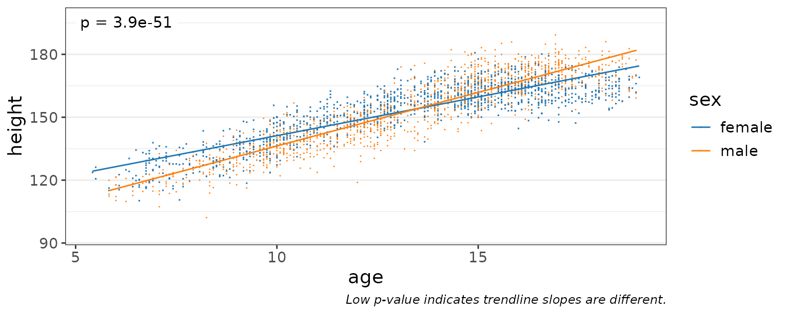
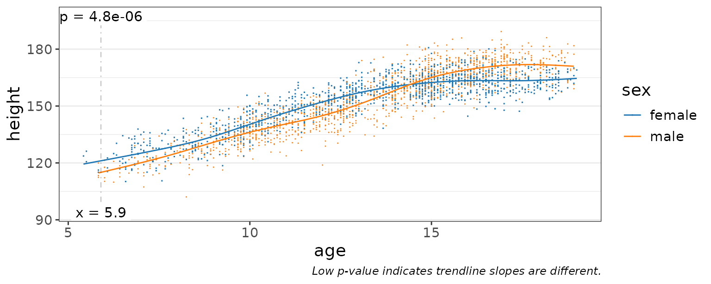
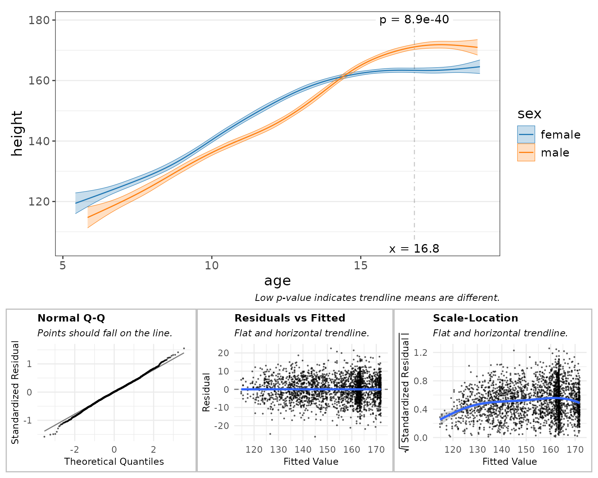
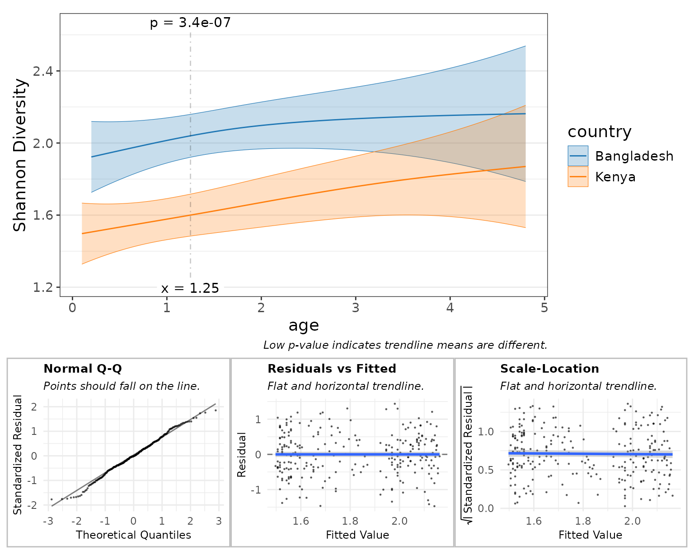

# Regression

## Introduction

Regression functions are provided for examining the association between
two continuous variables.

Examples of continuous variables are alpha diversity metrics, taxa
abundances, and sample metadata such as age or BMI. These all have a
numeric range in which a data point can take on any value in that range.

## Children Heights

To start with a simple example, consider the `children` dataset from the
R package `npregfast`. It records age, sex, and height for 2500 children
aged 5 through 19 years.

``` r
head(npregfast::children)
#>      sex height   age
#> 1   male 150.77 13.25
#> 2 female 170.59 14.17
#> 3 female 167.31 15.17
#> 4 female 165.72 16.58
#> 5 female 171.67 15.17
#> 6 female 143.74 12.67
```

### Height vs Age

First, let’s plot ‘age’ vs ‘height’, and overlay a best-fit linear
trendline.

With this plot, we’re testing the hypothesis “as you get older, your
height changes”.

``` r
stats_corrplot(
  df       = npregfast::children,  # dataset
  x        = 'age',                # x-axis variable
  y        = 'height',             # y-axis variable
  layers   = 'tp',                 # show trendline and points
  test     = 'emtrends',           # run stats on the slope
  fit      = 'lm',                 # straight trendline
  pt.size  = 0.2,                  # make points smaller
  pt.alpha = 0.2 )                 # and semi-transparent
```


As you’d expect, the trendline’s slope is positive (p-value = 0).
Therefore it’s safe to say that height changes with age.

### Grouped by Sex

Is the rate of growth influenced by sex? We can add `stat.by = "sex"` to
draw separate lines for males and females.

``` r
stats_corrplot(
  df       = npregfast::children,  # dataset
  x        = 'age',                # x-axis variable
  y        = 'height',             # y-axis variable
  stat.by  = 'sex',                # statistical groups   <====
  fit      = 'lm',                 # straight trendline
  layers   = 'tp',                 # show trendline and points
  test     = 'emtrends',           # run stats on the slopes
  pt.size  = 0.2 )                 # make points smaller
```



Here, a p-value of 3.9e-51 indicates that males and females do have
different growth rates.

If you look at the captions of the last two plots, you’ll notice that
the p-value test automatically changes.

- When `stat.by = NULL`, `test = "emtrends"` will test if the **slope is
  zero**.
- When `stat.by` is not `NULL`, `test = "emtrends"` will test if the
  trendline **slopes are equal**.

### Smoothed Fit

Linear trendlines probably aren’t the best way to model growth rates.
Setting `fit = "gam"` will use a generalized additive model which fits
several sub-ranges of age with independent splines.

``` r
stats_corrplot(
  df       = npregfast::children,  # dataset
  x        = 'age',                # x-axis variable
  y        = 'height',             # y-axis variable
  stat.by  = 'sex',                # statistical groups
  fit      = 'gam',                # smoothed trendline   <====
  layers   = 'tp',                 # show trendline and points
  test     = 'emtrends',           # run stats on the slopes
  pt.size  = 0.2 )                 # make points smaller
```



This gives us a much better idea of the moving average over time.

We still have `test = "emtrends"`, so the p-value is reported where the
difference in slope is most significant - in this case, at age = 5.9
years.

### Difference in Means

Let’s set `test = "emmeans"` instead, and show the 95% confidence
interval instead of all the data points.

``` r
stats_corrplot(
  df       = npregfast::children,  # dataset
  x        = 'age',                # x-axis variable
  y        = 'height',             # y-axis variable
  stat.by  = 'sex',                # statistical groups
  fit      = 'gam',                # smoothed trendline
  layers   = 'tc',                 # show trendline with conf. int.
  test     = 'emmeans' )           # run stats on the means   <====
```


Differences in height are most significant at age = 16.8 (where p-value
= 8.9e-40).

## Statistics Table

The complete statistical output is attached to the returned plot as
`$stats`.

You can also directly generate this table with the
[`stats_table()`](https://cmmr.github.io/rbiom/reference/stats_table.md)
function.

``` r
st <- stats_table(
  df       = npregfast::children,  # dataset
  regr     = 'age',                # x-axis variable
  resp     = 'height',             # y-axis variable
  stat.by  = 'sex',                # statistical groups
  fit      = 'gam',                # generalized additive model
  test     = 'emmeans' )           # run stats on the means

# Print the table transposed, since it's one row by 14 columns.
t(st)
#>              [,1]           
#> age          "16.8"         
#> sex          "female - male"
#> .mean.diff   "-7.730025"    
#> .h1          "!= 0"         
#> .p.val       "8.875599e-40" 
#> .adj.p       "8.875599e-40" 
#> .effect.size "-1.205401"    
#> .se          "0.5753545"    
#> .n           "2500"         
#> .df          "2485"         
#> .t.ratio     "-13.43524"    
#> .adj.r       "0.8313946"    
#> .aic         "16403.78"     
#> .bic         "16497.75"     
#> .loglik      "-8185.756"
```

Depending on the arguments given, the *estimate* term will be one of:

| **Field**   | **Description**          | `test`                                                                             | `stat.by`  |
|-------------|--------------------------|------------------------------------------------------------------------------------|------------|
| .mean       | Estimated marginal mean. | [`emmeans::emmeans()`](https://rvlenth.github.io/emmeans/reference/emmeans.html)   | `NULL`     |
| .mean.diff  | Difference in means.     | [`emmeans::emmeans()`](https://rvlenth.github.io/emmeans/reference/emmeans.html)   | not `NULL` |
| .slope      | Trendline slope.         | [`emmeans::emtrends()`](https://rvlenth.github.io/emmeans/reference/emtrends.html) | `NULL`     |
| .slope.diff | Difference in slopes.    | [`emmeans::emtrends()`](https://rvlenth.github.io/emmeans/reference/emtrends.html) | not `NULL` |

Other fields in this table include:

| **Field**    | **Description**                                                                                      |
|--------------|------------------------------------------------------------------------------------------------------|
| .h1          | Alternate hypothesis.                                                                                |
| .p.val       | Probability that null hypothesis is correct.                                                         |
| .adj.p       | `.p.val` after adjusting for multiple comparisons.                                                   |
| .effect.size | Effect size. See [`emmeans::eff_size()`](https://rvlenth.github.io/emmeans/reference/eff_size.html). |
| .lower       | Confidence interval lower bound.                                                                     |
| .upper       | Confidence interval upper bound.                                                                     |
| .se          | Standard error.                                                                                      |
| .n           | Number of samples.                                                                                   |
| .df          | Degrees of freedom.                                                                                  |
| .t.ratio     | *(.mean, .mean.diff, .slope, or .slope.diff)* / `.se`                                                |
| .r.sqr       | Percent of variation explained by the model.                                                         |
| .adj.r       | `.r.sqr`, taking degrees of freedom into account.                                                    |
| .aic         | Akaike Information Criterion (predictive models).                                                    |
| .bic         | Bayesian Information Criterion (descriptive models).                                                 |
| .loglik      | Log-likelihood goodness-of-fit score.                                                                |
| .fit.p       | P-value for observing this fit by chance.                                                            |

### Marginal Means

Estimated marginal means (EMMs; also known as least-squares means) are
means extracted from a statistical model. This allows EMMs to take into
account more complex associations and produce confidence intervals in
addition to estimates of the mean. This approach is employed by rbiom’s
`'emmeans'` and `'emtrends'` tests, using the
[`emmeans::emmeans`](https://rvlenth.github.io/emmeans/reference/emmeans.html)
package.

Additional information on EMMs is available at:

- [Marginalia: A Guide to Figuring Out What the Heck Marginal Effects
  Are](https://www.andrewheiss.com/blog/2022/05/20/marginalia/#marginal-effects-at-the-mean-the-default-in-emmeans)
- [Decomposing, Probing, and Plotting Interactions in
  R](https://stats.oarc.ucla.edu/r/seminars/interactions-r)

### Goodness of Fit

The statistics table has several fields for assessing how well the model
fits the data.

- `.r.sqr` - Coefficient of Determination (*R*²); range: 0-1, lower is
  better. Percent of variation explained by the model.
- `.adj.r` - *R*², taking degrees of freedom into account.
- `.aic` - Akaike Information Criterion; lower is better. Preferred when
  using model for prediction.
- `.bic` - Bayesian Information Criterion; lower is better. Preferred
  when using model for interpretation.
- `.loglik` - Log-Likelihood (negative values); higher values (closer to
  zero) are better.
- `.fit.p` - P-value for observing this fit by chance; range: 0-1, lower
  is better.

Not all of these values can be computed for every model.

As an example, lets pull the AIC value from the statistics table
generated in the last section.

``` r
st$.aic
#> [1] 16403.78
```

These values can be used to decide which `fit` argument to use (`"lm"`,
`"log"`, or `"gam"`).

``` r
plyr::ldply(c(lm="lm", log="log", gam="gam"), .id = "fit", function (fit)
  stats_table(npregfast::children, "age", "height", "sex", fit = fit) ) %>%
  dplyr::select(fit, .r.sqr:.fit.p)
#>   fit    .r.sqr    .adj.r     .aic     .bic   .loglik .fit.p
#> 1  lm 0.7896923 0.7894395 16947.72 16976.84 -8468.858      0
#> 2 log 0.8031003 0.8028636 16783.02 16812.14 -8386.512      0
#> 3 gam        NA 0.8313946 16403.78 16497.75 -8185.756     NA
```

Based on the above table, `fit = "gam"` has the lowest AIC, lowest BIC,
and highest Log-Likelihood, and is therefore the best model of the three
to use for this set of data and variables.

### Alternative Hypothesis

The three columns `.mean.diff`, `.h1`, and `.p.val` together show the
hypothesis and its outcome. Above, we’re asking if `.mean.diff` is
non-zero. Since `.p.val` is less than 0.05 we can say that it is.

``` r
dplyr::select(st, .mean.diff:.p.val)
#> # Model:    gam(height ~ s(age, by = sex, bs = "cs") + sex, method = "REML")
#> # A tibble: 1 × 3
#>   .mean.diff .h1     .p.val
#>        <dbl> <fct>    <dbl>
#> 1      -7.73 != 0  8.88e-40
```

For a more complete review of alternative hypotheses, see the [rbiom
statistics
article](https://cmmr.github.io/rbiom/articles/statistics.html#hypothesis).

## Checking Residuals

One of the best ways to assess the quality of your model is to
interrogate the residuals. A “residual” is the vertical distance from a
data point to the trendline; the difference between observed and
predicted (fitted) values.

High quality models will have randomly distributed residuals. Three
common plots for visualizing residuals are normal Q-Q plots, residual vs
fitted value plots, and scale-location plots. You can add these plots to
any rbiom corrplot by setting `check = TRUE`.

``` r
stats_corrplot(
  df       = npregfast::children,  # dataset
  x        = 'age',                # x-axis variable
  y        = 'height',             # y-axis variable
  stat.by  = 'sex',                # statistical groups
  fit      = 'gam',                # smoothed trendline
  layers   = 'tc',                 # show trendline with conf. int.
  test     = 'emmeans',            # run stats on the means
  check    = TRUE )                # display diagnostic plots   <====
```



The subtitle for each plot tells you what a high quality model will look
like. For example, the “Normal Q-Q” plot says that “Points should fall
on the line.” In this case they do, so that particular check indicates
high-quality.

These diagnostic plots are largely subjective/qualitative. That is, you
must use your best judgement to decide if the residuals appear to pass
or fail the checks.

A complete explanation of these diagnostic plots is beyond the scope of
this article. Readers are encouraged to explore the topic further at
sites such as:

- [The Four Assumptions of Linear
  Regression](https://www.statology.org/linear-regression-assumptions/)
- [Linear Regression Assumptions and Diagnostics in R:
  Essentials](http://www.sthda.com/english/articles/39-regression-model-diagnostics/161-linear-regression-assumptions-and-diagnostics-in-r-essentials/)
- [Understanding Diagnostic Plots for Linear Regression
  Analysis](https://library.virginia.edu/data/articles/diagnostic-plots).
- [Quantile-Quantile plots](https://rpubs.com/mbh038/725314)
- [Regression diagnostic
  plots](https://www.andrew.cmu.edu/user/achoulde/94842/homework/regression_diagnostics.html)

## GEMS Dataset

Going forward we’ll use the `gems` dataset included with rbiom. GEMS is
a case-control study comprising 1,006 stool samples from young children
with or without diarrhea in four low-income countries. The original
Nature article by Eric J. de Muinck and Pal Trosvik for this data set is
available online for free at [Individuality and Convergence of the
Infant Gut Microbiota During the First Year of
Life](https://www.nature.com/articles/s41467-018-04641-7).

``` r
gems
#> 
#> ══ Global Enteric Multicenter Study ════════════════════════
#> 
#> Stool samples collected from 1006 participants under the
#> age of 5 from Bangladesh, Gambia, Kenya, and Mali. Includes
#> 492 healthy controls and 514 moderate-to-severe diarrhea
#> (MSD) cases. Original study by Pop et al, 2014
#> (<https://doi.org/10.1186/gb-2014-15-6-r76>); dataset
#> retrieved from MicrobiomeDB
#> (<https://doi.org/10.1093/nar/gkx1027>).
#> 
#>    1006 Samples: SRS608640, SRS608279, SRS607780, ...
#>     767 OTUs:    OTU001, OTU002, OTU003, ..., and OTU767
#>       8 Ranks:   .otu, Kingdom, Phylum, ..., and Species
#>       4 Fields:  .sample, diarrhea, age, and country
#>         Tree:    <absent>
#> 
#> ── 116 - 11k reads/sample ──────────────────── 2021-03-15 ──
#> 


glimpse(gems)
#> Rows: 1,006
#> Columns: 4
#> $ .sample  <chr> "SRS608640", "SRS608279", "SRS607780", "SRS607987", "SRS60842…
#> $ diarrhea <fct> Control, Case, Case, Case, Control, Case, Case, Control, Cont…
#> $ age      <dbl> 0.2, 1.4, 0.8, 1.8, 0.6, 4.0, 0.5, 2.2, 0.4, 1.4, 2.1, 2.0, 0…
#> $ country  <fct> Bangladesh, Kenya, Gambia, Gambia, Kenya, Kenya, Mali, Gambia…
```

The `gems` metadata includes two categorical fields and one continuous
field:

| Field    | Type        | Values                             |
|----------|-------------|------------------------------------|
| diarrhea | categorical | Case or Control                    |
| age      | continuous  | 0 - 4.8 (years old)                |
| country  | categorical | Bangladesh, Gambia, Kenya, or Mali |

### Bangladesh vs Kenya Controls

To start, let’s select just the healthy controls from two countries,
then rarefy those samples to an even sequencing depth.

``` r
hbk <- gems %>%
  subset(diarrhea == "Control") %>%
  subset(country %in% c("Bangladesh", "Kenya")) %>%
  rarefy()

hbk$n_samples
#> [1] 256
```

## Alpha Diversity

Since we’re working with an rbiom object - `hbk` - we can use the
convenience function
[`adiv_corrplot()`](https://cmmr.github.io/rbiom/reference/adiv_corrplot.md),
which combines the steps of generating a table of alpha diversity values
([`adiv_table()`](https://cmmr.github.io/rbiom/reference/adiv_table.md))
and generating a correlation plot
([`stats_corrplot()`](https://cmmr.github.io/rbiom/reference/stats_corrplot.md)).

``` r
adiv_corrplot(
  biom    = hbk,         # healthy controls from Bangladesh and Kenya
  x       = "age",       # x-axis variable
  stat.by = "country",   # statistical groups
  fit     = "gam",       # smoothed trendline
  check   = TRUE )       # display diagnostic plots
```



Here, the diagnostic plots look pretty good, so we can confidently say
that children have different Shannon diversity index values, depending
on whether they live in Bangladesh vs Kenya, and that this difference is
most significant at around 1.25 years old.

## Taxa Abundance

Similar to
[`adiv_corrplot()`](https://cmmr.github.io/rbiom/reference/adiv_corrplot.md),
[`taxa_corrplot()`](https://cmmr.github.io/rbiom/reference/taxa_corrplot.md)
combines
[`taxa_table()`](https://cmmr.github.io/rbiom/reference/taxa_matrix.md)
and
[`stats_corrplot()`](https://cmmr.github.io/rbiom/reference/stats_corrplot.md)
into a single streamlined function.

We’ll set `layers = "tcrp"` to show the residuals on this main plot.
This will help in explaining an artifact on the “Residuals vs Fitted”
diagnostic plot.

``` r
taxa_corrplot(
  biom    = hbk,         # healthy controls from Bangladesh and Kenya
  layers  = "tcrp",      # trendlines, conf. intervals, residuals, & points
  x       = "age",       # x-axis variable
  taxa    = 1,           # select the most abundant taxa
  rank    = "Genus",     # at the genus level
  stat.by = "country",   # statistical groups
  fit     = "gam",       # smoothed trendline
  t.size  = 2,           # make the trendline thicker
  check   = TRUE )       # display diagnostic plots
#> Warning: Using `size` aesthetic for lines was deprecated in ggplot2 3.4.0.
#> ℹ Please use `linewidth` instead.
#> ℹ The deprecated feature was likely used in the rbiom package.
#>   Please report the issue at <https://github.com/cmmr/rbiom/issues>.
#> This warning is displayed once per session.
#> Call `lifecycle::last_lifecycle_warnings()` to see where this warning was
#> generated.
```


Above, all the orange and blue points falling on y=0 indicate there are
zero Prevotella reads for that sample. This can confound taxa abundance
analyses, as indicated by the diagnostic plots.

- Normal Q-Q: This curved shape indicates residuals are more often below
  the trendline.
- Residuals vs Fitted: The points forming a straight black diagonal
  ‘line’ are the result of a overabundance of a single value in the data
  (zero).
- Scale-Location: The first half of the curve is due to lots of zero
  counts. The second half of the curve is due to having few samples with
  greater than 350 rarefied Prevotella counts, thereby allowing the gam
  curve to intercept those sample points with better precision.

### Rank Transformation

One method for addessing zero abundances is to rank tranform all the
abundances. In rbiom, setting `trans = "rank"` will rank transform all
the abundances, without consideration of facets. The default parameters
`ties = "random", seed = 0` will assign unique integers (see
[`base::rank()`](https://rdrr.io/r/base/rank.html) for other `ties`
options).

This will improve the diagnostic plots, but adds noise to the data.

``` r
taxa_corrplot(
  biom    = hbk,         # healthy controls from Bangladesh and Kenya
  layers  = "tcrp",      # show residuals on the main plot
  x       = "age",       # x-axis variable
  taxa    = 1,           # select the most abundant taxa
  rank    = "Genus",     # at the genus level
  stat.by = "country",   # statistical groups
  fit     = "gam",       # smoothed trendline
  trans   = "rank",      # rank-transform the abundances   <====
  t.size  = 2,           # make the trendline thicker
  check   = TRUE )       # display diagnostic plots
```


## Beta Diversity

Like the last two corrplot functions,
[`bdiv_corrplot()`](https://cmmr.github.io/rbiom/reference/bdiv_corrplot.md)
combines
[`bdiv_table()`](https://cmmr.github.io/rbiom/reference/bdiv_table.md)
and
[`stats_corrplot()`](https://cmmr.github.io/rbiom/reference/stats_corrplot.md)
to generate a beta diversity correlation plot from an rbiom object.

Beta diversity correlation plots are more conceptually complex, so let’s
quickly review what we’ll be plotting.

- x-axis: the difference in a numeric metadata field between two
  samples.
- y-axis: the difference in overall microbiome composition.

As with most `bdiv_*` functions, we can supply a `within` and/or
`between` parameters to limit which pairs of samples are included in the
plot. Setting `within = "country"` as below will only plot pairs of
samples that came from the same country, and prevent `stat.by` from
producing a “Bangladesh vs Kenya” trendline.

``` r
bdiv_corrplot(
  biom    = hbk,         # healthy controls from Bangladesh and Kenya
  x       = "age",       # x-axis variable
  stat.by = "country",   # statistical groups 
  within  = "country",   # don't compare samples from different countries
  fit     = "gam",       # smoothed trendline
  check   = TRUE )       # display diagnostic plots
```


Here, the main plot tells us:

- In Bangladesh, the closer two children are in age to each other, the
  more similar their microbiomes will be. Therefore, you could infer
  that age is an important factor driving microbiome structure for this
  population.
- Kenyan children’s microbiomes are more consistently structured,
  compared to children in Bangladesh. Additionally, the age effect is
  much less pronounced.
- Children about 1 year apart in age have much more similar microbiome
  if they live in Kenya, compared to Bangladesh (p = 6.2e-153).

The diagnostic plots here indicate less than optimal distributions of
residuals, with the “Normal Q-Q” plot showing that many more points lie
above the trendline than below it. The main plot’s trendlines don’t
spend much time between y = 0.75 and 0.83, hence the sparsity of points
between x = 0.75 and 0.83 on the “Residuals vs Fitted” and
“Scale-Location” plots.

### Rank Transformation

Running
[`bdiv_corrplot()`](https://cmmr.github.io/rbiom/reference/bdiv_corrplot.md)
with `trans = "rank"` could help make the residuals more normally
distributed.

``` r
bdiv_corrplot(
  biom    = hbk,         # healthy controls from Bangladesh and Kenya
  x       = "age",       # x-axis variable
  stat.by = "country",   # statistical groups 
  within  = "country",   # don't compare samples from different countries
  fit     = "gam",       # smoothed trendline
  trans   = "rank",      # rank-transform the abundances   <====
  check   = TRUE )       # display diagnostic plots
```


After rank-transforming:

- The main plot tells a slightly different story.
- The “Normal Q-Q” plot indicates that the residuals now have a
  light-tailed distribution.

You could argue either for or against preferring the transformed figure
over the original.

### Goodness of Fit

Comparing the AIC, BIC, and Log-Likelihood values for the untransformed
and rank-transformed data can tell you which model is better, right?
Wrong! These values scale with the range of the data, so the
untransformed beta diversity data in the range of 0 - 1 will result in
drastically different AIC, BIC, and Log-Likelihood values than the
rank-transformed data in the range of 1 - 16400.

Generally speaking, you cannot compare goodness-of-fit values derived
from different datasets. However, it is arguable that these two datasets
are the same, just scaled differently. Therefore if you don’t mind
potentially incurring a reviewer’s wrath, you can rescale both datasets
to the same range and compare goodness-of-fit values on those.

``` r
plyr::ldply(c(none="none", rank="rank"), .id = "trans", function (trans)
  bdiv_table(biom = hbk, within = "country", trans = trans) %>%
    dplyr::mutate(.distance = scales::rescale(.distance, to = c(0, 1))) %>%
    stats_table(regr = "age", resp = ".distance", stat.by = "country", fit = "gam") %>%
    dplyr::select(.aic, .bic, .loglik) )
#>   trans      .aic      .bic   .loglik
#> 1  none -3112.365 -3028.741  1567.036
#> 2  rank  4513.687  4629.266 -2241.843
```

These goodness-of-fit metrics strongly favor the untransformed data.

## Specific Timepoints

By default, the `*_corrplot()` functions will automatically find the
x-axis location with the most significant term of interest. However, you
can override this by providing the `at` parameter.

``` r
stats_corrplot(npregfast::children, 'age', 'height', stat.by = 'sex', at = 12)
```


Although you’re limited to one `at` value for `*_corrplot()` functions,
you can provide multiple `at` locations to
[`stats_table()`](https://cmmr.github.io/rbiom/reference/stats_table.md)
or `*_stats()` functions.

``` r
stats_table(npregfast::children, 'age', 'height', stat.by = 'sex', at = 11:15)
#> # Model:    gam(height ~ s(age, by = sex, bs = "cs") + sex, method = "REML")
#> # A tibble: 5 × 15
#>     age sex    .mean.diff .h1     .p.val   .adj.p .effect.size   .se    .n   .df
#>   <int> <fct>       <dbl> <fct>    <dbl>    <dbl>        <dbl> <dbl> <int> <int>
#> 1    12 femal…       7.23 != 0  2.46e-29 1.23e-28        1.13  0.635  2500  2485
#> 2    11 femal…       6.02 != 0  2.75e-22 6.88e-22        0.939 0.614  2500  2485
#> 3    13 femal…       6.04 != 0  6.06e-21 1.01e-20        0.943 0.638  2500  2485
#> 4    15 femal…      -2.58 != 0  7.21e- 7 9.02e- 7       -0.402 0.519  2500  2485
#> 5    14 femal…       2.00 != 0  3.14e- 4 3.14e- 4        0.311 0.553  2500  2485
#> # ℹ 5 more variables: .t.ratio <dbl>, .adj.r <dbl>, .aic <dbl>, .bic <dbl>,
#> #   .loglik <dbl>
```
