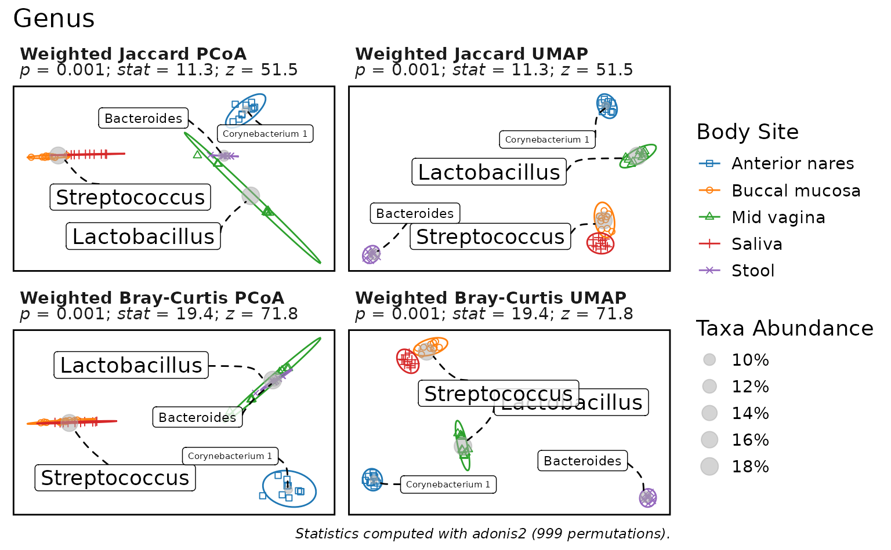
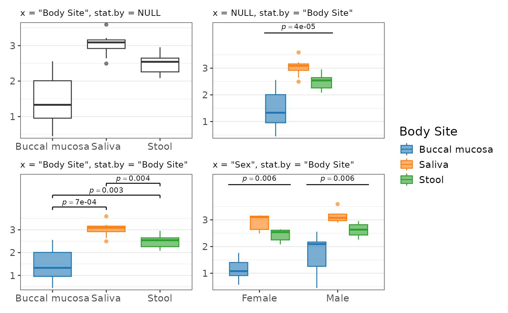
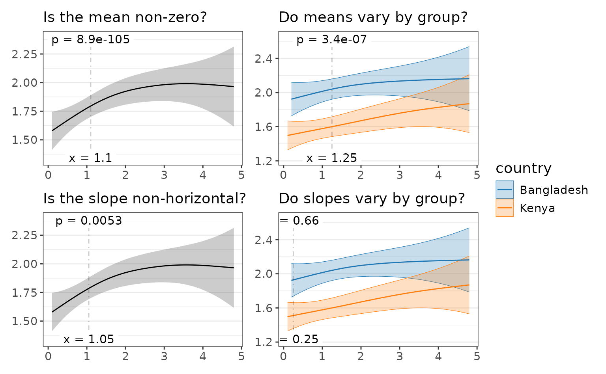
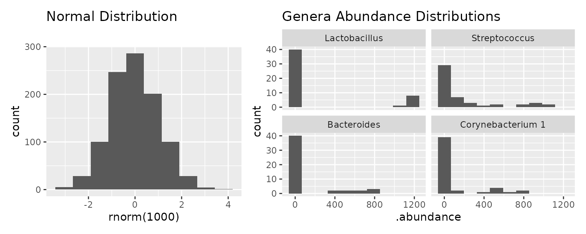
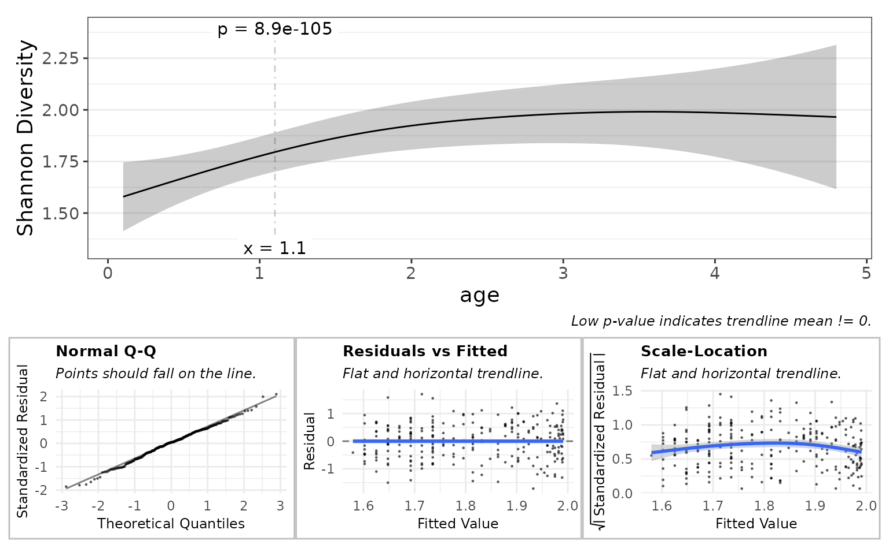

# Statistics

## Quick Start

The rbiom package includes many statistical functions. If you have an
rbiom object, you can use dedicated functions for alpha diversity, beta
diversity, and taxa abundance. Otherwise, look to the generic functions
that operate on any data.frame or distance matrix.

### rbiom Object Functions

Your metadata field and microbiome property of interest will determine
which rbiom function to use.

[TABLE]

For instance, to explore the effect of Body Site (a categorical metadata
field) on Shannon Diversity (an alpha diversity metric), we’d use
[`adiv_boxplot()`](https://cmmr.github.io/rbiom/reference/adiv_boxplot.md)
to produce a plot with statistics, or
[`adiv_stats()`](https://cmmr.github.io/rbiom/reference/adiv_stats.md)
if we only want the stats.

### Generic Functions

If your data is in a data.frame (or tibble), use:

|                                                                              |                                                                                |                                                                          |
|------------------------------------------------------------------------------|--------------------------------------------------------------------------------|--------------------------------------------------------------------------|
| [`stats_boxplot()`](https://cmmr.github.io/rbiom/reference/stats_boxplot.md) | [`stats_corrplot()`](https://cmmr.github.io/rbiom/reference/stats_corrplot.md) | [`stats_table()`](https://cmmr.github.io/rbiom/reference/stats_table.md) |

Or, for a distance matrix:

|                                                                              |
|------------------------------------------------------------------------------|
| [`distmat_stats()`](https://cmmr.github.io/rbiom/reference/distmat_stats.md) |

## Statistics Table

The function
[`stats_table()`](https://cmmr.github.io/rbiom/reference/stats_table.md)
and functions ending in “\_stats”
(e.g. [`adiv_stats()`](https://cmmr.github.io/rbiom/reference/adiv_stats.md),
[`distmat_stats()`](https://cmmr.github.io/rbiom/reference/distmat_stats.md))
will return a statistics table. Functions with “plot” in their name
(e.g. [`adiv_boxplot()`](https://cmmr.github.io/rbiom/reference/adiv_boxplot.md),
[`stats_corrplot()`](https://cmmr.github.io/rbiom/reference/stats_corrplot.md))
will return a plot object `p`. You can access the plot’s associated
statistics table with `p$stats`.

``` r
p <- adiv_boxplot(
  biom     = rarefy(hmp50),           # Dataset as an rbiom object
  adiv     = c("Shannon", "Simpson"), # Alpha diversity metrics
  stat.by  = "Body Site",             # Statistical groups
  facet.by = "Sex" )                  # Split data prior to stats

p$stats
#> # Model:    kruskal.test(.diversity ~ `Body Site`)
#> # A tibble: 4 × 8
#>   Sex    .adiv   .stat .h1      .p.val   .adj.p    .n   .df
#>   <fct>  <fct>   <dbl> <fct>     <dbl>    <dbl> <int> <int>
#> 1 Female simpson  24.5 > 0   0.0000620 0.000186    30     4
#> 2 Female shannon  23.7 > 0   0.0000929 0.000186    30     4
#> 3 Male   shannon  14.3 > 0   0.00248   0.00314     19     3
#> 4 Male   simpson  13.8 > 0   0.00314   0.00314     19     3
```

This table has the following information:

### Model

In the upper-left corner, we see
`` Model: kruskal.test(.diversity ~ `Body Site`) ``. This tells us that
the underlying test used here is base R’s
[`kruskal.test()`](https://rdrr.io/r/stats/kruskal.test.html), grouping
values of `.diversity` by `` `Body Site` ``. In rbiom, `.diversity` is
the default name for the column containing alpha diversity values.

### Multiple Comparisons

The above table has four rows, meaning we ran data through the model
four times. In this case, it was two alpha diversity metrics times two
`Sex` facets. The first two columns of the table (`Sex` and `.adiv`)
tell us which row is for each combination. Additionally, the `.adj.p`
column is the `.p.val` adjusted for multiple comparisons.

### Hypothesis

The three columns `.stat`, `.h1`, and `.p.val` together show the
hypothesis and its outcome. Above, we’re asking if `.stat` is greater
than zero. When `.p.val` is less than 0.05 we can say that it is.

That’s the very simplified explanation.

Recall from your statistic classes that you are testing a null
hypothesis H₀ against an alternate hypothesis H₁. In this case, our null
hypothesis is that the Kruskal-Wallis statistic is zero (`.stat == 0`),
indicating all `` `Body Site` `` groups have similar alpha diversity.
The p-value is the probability that the null hypothesis is correct (a
p-value of 0.6 is interpreted as a 60% chance that `.stat == 0`). When
the p-value is below a certain value (usually 0.05) we accept the
alternative hypothesis instead - in this case that `.stat > 0`, meaning
`.diversity` does vary by `` `Body Site` ``.

### Terms of Interest

The last two columns are:

- `.n` - The number of samples. After rarefying, we have 30 females and
  19 males.
- `.df` - Degrees of freedom. One less than the number of groups. The
  HMP50 dataset has five body sites: Anterior nares, buccal mucosa, mid
  vagina, saliva, and stool. However, the male facets don’t have any mid
  vagina samples.

### Data and Code

You can inspect the data passed to
[`kruskal.test()`](https://rdrr.io/r/stats/kruskal.test.html) by looking
at `p$data`. Additionally, the code used to generate the statistics is
available in `p$stats$code`. These attributes can help you reproduce and
customize your data analysis.

``` r
p$data
#> # A tibble: 98 × 6
#>   .sample .depth .adiv   .diversity `Body Site`   Sex   
#> * <chr>    <dbl> <fct>        <dbl> <fct>         <fct> 
#> 1 HMP01     1183 shannon       1.71 Buccal mucosa Female
#> 2 HMP02     1183 shannon       2.58 Buccal mucosa Male  
#> 3 HMP03     1183 shannon       2.92 Saliva        Male  
#> 4 HMP04     1183 shannon       3.26 Saliva        Male  
#> 5 HMP05     1183 shannon       1.43 Buccal mucosa Female
#> # ℹ 93 more rows

p$stats$code
#> data <- adiv_table(biom, c("Shannon", "Simpson"), c("Body Site", "Sex"), cpus = 4)
#> 
#> data %<>% dplyr::rename(
#>   .resp    = ".diversity", 
#>   .stat.by = "Body Site" )
#> 
#> stats <- plyr::ddply(data, .(Sex, .adiv), function (data) {
#>   tryCatch(error = function (e) data.frame()[1,], suppressWarnings({
#> 
#>     data %>% 
#>       stats::kruskal.test(.resp ~ .stat.by, .) %>%
#>       with(tibble(
#>         .stat  = statistic, 
#>         .h1    = factor('> 0'), 
#>         .p.val = p.value, 
#>         .n     = nrow(data), 
#>         .df    = parameter ))
#> 
#>   }))
#> }) %>% 
#>   tibble::as_tibble() %>% 
#>   dplyr::mutate(.adj.p = p.adjust(.p.val, 'fdr'), .after = .p.val) %>% 
#>   dplyr::arrange(.p.val)
```

When generating statistics with `st <- adiv_stats()`,
[`bdiv_stats()`](https://cmmr.github.io/rbiom/reference/bdiv_stats.md),
or
[`taxa_stats()`](https://cmmr.github.io/rbiom/reference/taxa_stats.md),
the data and code are in `st$data` and `st$code`, respectively. For
`st <- stats_table(df = df)`, the data and code are in `df` and
`st$code`, respectively.

### Column Reference

Care has been taken to keep rbiom’s statistics tables consistent across
functions. However, some tables will provide more information when it is
available from the underlying statistical function.

Below is a quick reference guide to all columns that may appear in an
rbiom statistics table.

| **Field**      | **Description**                                                                                                     |
|----------------|---------------------------------------------------------------------------------------------------------------------|
| `.stat`        | Wilcoxon or Kruskal-Wallis rank sum statistic.                                                                      |
| `.mean`        | Estimated marginal mean. See [`emmeans::emmeans()`](https://rvlenth.github.io/emmeans/reference/emmeans.html).      |
| `.mean.diff`   | Difference in means.                                                                                                |
| `.slope`       | Trendline slope. See [`emmeans::emtrends()`](https://rvlenth.github.io/emmeans/reference/emtrends.html).            |
| `.slope.diff`  | Difference in slopes.                                                                                               |
| `.h1`          | Alternate hypothesis.                                                                                               |
| `.p.val`       | Probability that null hypothesis is correct.                                                                        |
| `.adj.p`       | `.p.val` after adjusting for multiple comparisons.                                                                  |
| `.effect.size` | Effect size. See [`emmeans::eff_size()`](https://rvlenth.github.io/emmeans/reference/eff_size.html).                |
| `.lower`       | Confidence interval lower bound.                                                                                    |
| `.upper`       | Confidence interval upper bound.                                                                                    |
| `.se`          | Standard error.                                                                                                     |
| `.n`           | Number of samples.                                                                                                  |
| `.df`          | Degrees of freedom.                                                                                                 |
| `.t.ratio`     | *(.mean, .mean.diff, .slope, or .slope.diff)* / `.se`                                                               |
| `.z`           | Std. effect size. See [`vegan::summary.permustats()`](https://vegandevs.github.io/vegan/reference/permustats.html). |
| `.r.sqr`       | Percent of variation explained by the model.                                                                        |
| `.adj.r`       | `.r.sqr`, taking degrees of freedom into account.                                                                   |
| `.aic`         | Akaike Information Criterion (predictive models).                                                                   |
| `.bic`         | Bayesian Information Criterion (descriptive models).                                                                |
| `.loglik`      | Log-likelihood goodness-of-fit score.                                                                               |
| `.fit.p`       | P-value for observing this fit by chance.                                                                           |

The `.h1` field will always come immediately after the column it is
testing against.

## Plot Output

Visualizations are one of the best ways to identify correlations in your
dataset. If you can see a trend with your eyes, then you’re on the right
track. The statistics-supported plotting functions in rbiom are
ordination plots, box plots, and correlation plots.

### Ordination Plots

Statistics for ordination plots are the most straight-forward. Set a
categorical metadata field to the `stat.by` parameter to test whether
inter-sample distances are correlated with that variable.

``` r
p <- bdiv_ord_plot(
  biom    = rarefy(hmp50), 
  stat.by = "Body Site", 
  bdiv    = c("Jaccard", "Bray-Curtis"), 
  ord     = c("PCoA", "UMAP") )
p
#> Warning in MASS::cov.trob(data[, vars], wt = weight * nrow(data)): Probable
#> convergence failure
```



``` r
p$stats
#> # Test:     adonis2 ~ `Body Site`. 999 permutations.
#> # A tibble: 2 × 6
#>   .bdiv          .n .stat    .z .p.val .adj.p
#>   <chr>       <int> <dbl> <dbl>  <dbl>  <dbl>
#> 1 Jaccard        49  7.23  38.9  0.001  0.001
#> 2 Bray-Curtis    49 19.5   72.1  0.001  0.001

p$stats$code
#> iters   <- list(bdiv = c("Jaccard", "Bray-Curtis"))
#> dm_list <- blply(biom, NULL, bdiv_distmat, iters = iters, prefix = TRUE)
#> stats   <- plyr::ldply(dm_list, function (dm) {
#>   groups <- pull(biom, "Body Site")[attr(dm, 'Labels')]
#>   set.seed(0)
#>   ptest  <- vegan::adonis2(formula = dm ~ groups, permutations = 999)
#>   pstats <- summary(vegan::permustats(ptest))
#>   with(pstats, data.frame(statistic, z, p))
#> })
```

The plot subtitles have the summary statistics. Additionally, `p$stats`
contains a tibble data.frame with the full statistics table, and
`p$stats$code` shows the R commands for reproducing the statistics
outside of rbiom.

Note that the ordination statistics are not dependent on the ordination,
only the distance metric. This is because the statistics are based on
beta diversity distances which are computed prior to ordination.

By default,
[`bdiv_ord_plot()`](https://cmmr.github.io/rbiom/reference/bdiv_ord_plot.md)
applies the perMANOVA test. You can change this to MRPP by specifying
`test="mrpp"`. Details on the available tests are below.

| Test      | Function                                                                      | Method                                                      |
|-----------|-------------------------------------------------------------------------------|-------------------------------------------------------------|
| `adonis2` | [`vegan::adonis2()`](https://vegandevs.github.io/vegan/reference/adonis.html) | Permutational Multivariate Analysis of Variance (perMANOVA) |
| `mrpp`    | [`vegan::mrpp()`](https://vegandevs.github.io/vegan/reference/mrpp.html)      | Multiple Response Permutation Procedure (MRPP)              |

### Box Plots

Statistics on box plots will automatically toggle between pairwise and
group-wise statistics based on the values of `x` and `stat.by`: `x`
controls pairwise and `stat.by` controls group-wise. You can set `x` and
`stat.by` to the same categorical metadata field to get colored pairwise
statistics, or set them to different categorical metadata fields to get
multiple group-wise statistics per plot.

``` r
biom <- rarefy(hmp50) %>% 
  subset(`Body Site` %in% c('Saliva', 'Stool', 'Buccal mucosa'))

p1 <- adiv_boxplot(biom, x = "Body Site", stat.by = NULL)
p2 <- adiv_boxplot(biom, x = NULL,        stat.by = "Body Site")
p3 <- adiv_boxplot(biom, x = "Body Site", stat.by = "Body Site")
p4 <- adiv_boxplot(biom, x = "Sex",       stat.by = "Body Site")

plots <- list(
  p1 + ggplot2::labs(subtitle = 'x = "Body Site", stat.by = NULL'), 
  p2 + ggplot2::labs(subtitle = 'x = NULL, stat.by = "Body Site"'), 
  p3 + ggplot2::labs(subtitle = 'x = "Body Site", stat.by = "Body Site"'), 
  p4 + ggplot2::labs(subtitle = 'x = "Sex", stat.by = "Body Site"') ) %>%
  lapply(`+`, ggplot2::labs(x = NULL, y = NULL, caption = NULL)) %>%
  lapply(`+`, ggplot2::theme(plot.subtitle = ggplot2::element_text(size = 10)))

patchwork::wrap_plots(plots, guides = "collect")
```



Above, the lower-left plot is annotated with pairwise statistics while
the two on the right have group-wise statistics. As with other plots,
you can find the full statistics tables and reproducible R code in the
plot attributes.

``` r
p3$stats
#> # Model:    wilcox.test(.diversity ~ `Body Site`)
#> # A tibble: 3 × 9
#>   `Body Site`         .mean.diff .h1    .p.val  .adj.p .lower .upper    .n .stat
#>   <fct>                    <dbl> <fct>   <dbl>   <dbl>  <dbl>  <dbl> <int> <dbl>
#> 1 Buccal mucosa - Sa…     -1.67  != 0  2.46e-4 7.38e-4 -2.20  -0.975    20     1
#> 2 Buccal mucosa - St…     -1.12  != 0  2.20e-3 2.88e-3 -1.70  -0.466    19     7
#> 3 Saliva - Stool           0.463 != 0  2.88e-3 2.88e-3  0.210  0.847    19    82

p2$stats
#> # Model:    kruskal.test(.diversity ~ `Body Site`)
#> # A tibble: 1 × 6
#>   .stat .h1      .p.val    .adj.p    .n   .df
#>   <dbl> <fct>     <dbl>     <dbl> <int> <int>
#> 1  20.6 > 0   0.0000329 0.0000329    29     2

p2$stats$code
#> data <- adiv_table(biom, "Shannon", "Body Site", cpus = 4)
#> 
#> data %<>% dplyr::rename(
#>   .resp    = ".diversity", 
#>   .stat.by = "Body Site" )
#> 
#> stats <- data %>% 
#>   stats::kruskal.test(.resp ~ .stat.by, .) %>%
#>   with(tibble(
#>     .stat  = statistic, 
#>     .h1    = factor('> 0'), 
#>     .p.val = p.value, 
#>     .n     = nrow(data), 
#>     .df    = parameter )) %>% 
#>   dplyr::mutate(.adj.p = p.adjust(.p.val, 'fdr'), .after = .p.val) %>% 
#>   dplyr::arrange(.p.val)
```

Internally, rbiom uses the non-parametric functions listed below.

| Test       | Function                                                             | Method                                                   |
|------------|----------------------------------------------------------------------|----------------------------------------------------------|
| pairwise   | [`stats::wilcox.test()`](https://rdrr.io/r/stats/wilcox.test.html)   | Two-sample Wilcoxon Rank Sum Test, aka Mann-Whitney Test |
| group-wise | [`stats::kruskal.test()`](https://rdrr.io/r/stats/kruskal.test.html) | Kruskal-Wallis Rank Sum Test                             |

### Correlation Plots

For an in-depth description of correlation plots, see the [rbiom
regression
article](https://cmmr.github.io/rbiom/articles/regression.md).

Depending on the arguments given to `stat.by` and `test`, you can test:

- Is the mean non-zero?
- Do means vary by group?
- Is the slope (trendline) non-horizontal?
- Do slopes vary by group?

``` r
biom <- gems %>%
  subset(diarrhea == "Control") %>%
  subset(country %in% c("Bangladesh", "Kenya")) %>%
  rarefy()

p1 <- adiv_corrplot(biom, x = "age", test = "emmeans")
p2 <- adiv_corrplot(biom, x = "age", test = "emmeans", stat.by = "country")
p3 <- adiv_corrplot(biom, x = "age", test = "emtrends")
p4 <- adiv_corrplot(biom, x = "age", test = "emtrends", stat.by = "country")

plots <- list(
  p1 + ggplot2::labs(subtitle = 'Is the mean non-zero?'), 
  p2 + ggplot2::labs(subtitle = 'Do means vary by group?'), 
  p3 + ggplot2::labs(subtitle = 'Is the slope non-horizontal?'), 
  p4 + ggplot2::labs(subtitle = 'Do slopes vary by group?')) %>%
  lapply(`+`, ggplot2::labs(x = NULL, y = NULL, caption = NULL))

patchwork::wrap_plots(plots, guides = "collect")
```



## Background

### Normality

A normal distribution is visualized as a “bell curve”, where values
further from the mean are observed less often. Microbial abundances do
not follow this pattern; it’s common to observe high or low abundances
more often than a “medium” abundance.

``` r
library(ggplot2)

patchwork::wrap_plots(
  widths = c(1, 1.5),

  ggplot() + 
    geom_histogram(aes(x=rnorm(1000)), bins = 10) + 
    ggtitle("Normal Distribution"),
    
  ggplot(data = taxa_table(rarefy(hmp50), taxa = 4)) + 
    geom_histogram(aes(x=.abundance), bins = 10) + 
    facet_wrap(".taxa") + 
    ggtitle("Genera Abundance Distributions")
)
```



To compensate for this non-normality, rbiom uses the following
non-parametric tests for categorical variables that are based on ranking
or permutations.

| Test                    | Function                                                                      | Used For                                                                              |
|-------------------------|-------------------------------------------------------------------------------|---------------------------------------------------------------------------------------|
| Wilcoxon Rank-Sum       | [`stats::wilcox.test()`](https://rdrr.io/r/stats/wilcox.test.html)            | Pairwise boxplot                                                                      |
| Kruskal-Wallis Rank Sum | [`stats::kruskal.test()`](https://rdrr.io/r/stats/kruskal.test.html)          | Groupwise boxplot                                                                     |
| Permutational MANOVA    | [`vegan::adonis2()`](https://vegandevs.github.io/vegan/reference/adonis.html) | [`bdiv_ord_plot()`](https://cmmr.github.io/rbiom/reference/bdiv_ord_plot.md) clusters |

For correlation/regression analysis, rbiom provides diagnostic plots to
determine when residual distributions are cause for concern. To enable
this feature, set `check = TRUE`.

``` r
adiv_corrplot(biom, x = "age", test = "emmeans", check = TRUE)
```



Further reading:

- [Applied Multivariate Statistics in
  R](https://uw.pressbooks.pub/appliedmultivariatestatistics/):
  [PERMANOVA](https://uw.pressbooks.pub/appliedmultivariatestatistics/chapter/permanova/),
  [Comparison of
  Techniques](https://uw.pressbooks.pub/appliedmultivariatestatistics/chapter/comparison-of-techniques/)
- [R Applications — Part 1: Simple Linear
  Regression](https://medium.com/datasciencearth/r-applications-part-1-simple-linear-regression-ef5a0e19a05d),
  particularly the section on [assumption
  control](https://medium.com/datasciencearth/r-applications-part-1-simple-linear-regression-ef5a0e19a05d#a6f6).

### Compositionality

Compositional data arises when the counts don’t represent the entire
population. In microbiome studies, the number of microbes that get
sequenced is far less than the number of microbes from where the sample
was collected. Articles by [Gloor et
al](https://doi.org/10.3389/fmicb.2017.02224) and [McMurdie and
Holmes](https://doi.org/10.1371/journal.pcbi.1003531) propose the use of
their analysis tools (
[ALDEx2](https://doi.org/doi:10.18129/B9.bioc.ALDEx2) and
[metagenomeSeq](https://doi.org/doi:10.18129/B9.bioc.metagenomeSeq),
respectively) to apply the proper statistical methods for this
situation. Conversely, rbiom does not correct for compositionality. This
is because correcting for compositionality introduces extra noise into
the dataset and severely limits the selection of metrics and
visualizations, typically without any significant benefit to analysis.
