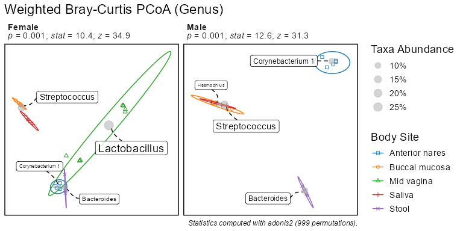
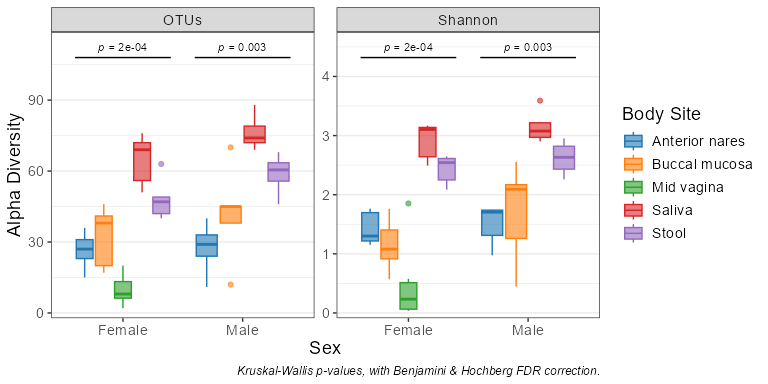
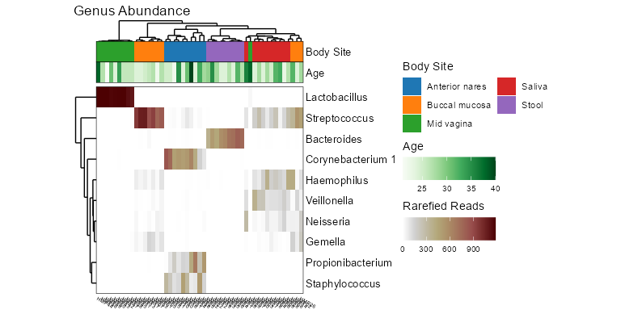

# rbiom 

`rbiom` is designed for microbiome researchers, providing visualizations
and statistical analyses from Biological Observation Matrix (BIOM)
files.

## Installation

The latest stable version can be installed from CRAN.

``` r
install.packages('rbiom')
```

The development version is available on GitHub.

``` r
install.packages('pak')
pak::pak('cmmr/rbiom')
```

## Usage

#### Import and rarefy abundance counts.

``` r
library(rbiom)

infile <- system.file(package = 'rbiom', 'extdata', 'hmp50.bz2')
biom   <- rarefy(infile)
```

#### Explore associations with metadata.

``` r
bdiv_ord_plot(biom, stat.by = 'Body Site', facet.by = 'Sex')
```



``` r
adiv_boxplot(biom, x = 'Sex', adiv = c('otu', 'shan'), stat.by = 'Body Site')
```



``` r
subset(biom, `Body Site` == 'Buccal mucosa') %>% 
  taxa_corrplot('Age', taxa = 2, layers = 'ptc', fit = 'lm', test = 'emtrends')
```


#### Summarize counts by taxonomic rank.

``` r
taxa_heatmap(biom, taxa = 10, tracks = c('body', 'age'))
```



``` r
taxa_stacked(biom, rank = 'Phylum')
```


``` r
taxa_table(biom, 'Phylum')
#> # A tibble: 294 × 8
#>    .rank  .sample .taxa          .abundance   Age   BMI `Body Site`   Sex   
#>    <fct>  <chr>   <fct>               <dbl> <dbl> <dbl> <fct>         <fct> 
#>  1 Phylum HMP01   Firmicutes            866    22    20 Buccal mucosa Female
#>  2 Phylum HMP01   Bacteroidetes         202    22    20 Buccal mucosa Female
#>  3 Phylum HMP01   Actinobacteria         14    22    20 Buccal mucosa Female
#>  4 Phylum HMP01   Proteobacteria         60    22    20 Buccal mucosa Female
#>  5 Phylum HMP01   Fusobacteria           33    22    20 Buccal mucosa Female
#>  6 Phylum HMP01   Tenericutes             0    22    20 Buccal mucosa Female
#>  7 Phylum HMP02   Firmicutes            814    24    23 Buccal mucosa Male  
#>  8 Phylum HMP02   Bacteroidetes         181    24    23 Buccal mucosa Male  
#>  9 Phylum HMP02   Actinobacteria         49    24    23 Buccal mucosa Male  
#> 10 Phylum HMP02   Proteobacteria         97    24    23 Buccal mucosa Male  
#> # ℹ 284 more rows
```

## Documentation

The online manual for `rbiom` is available at
<https://cmmr.github.io/rbiom/>. It includes a getting started guide,
articles that explore specific use cases, and reference pages for each
function.

## Community guidelines

### Support

Bug reports, feature requests, and general questions can be submitted at
<https://github.com/cmmr/rbiom/issues>.

### Contributing

Pull requests are welcome. Please ensure contributed code is covered by
tests and documentation (add additional tests and documentation as
needed) and that it passes all automated tests.

## Automated tests

The following commands will check if `rbiom` passes the bundled testing
suite.

``` r
install.packages('testthat')
testthat::test_check('rbiom')
```
