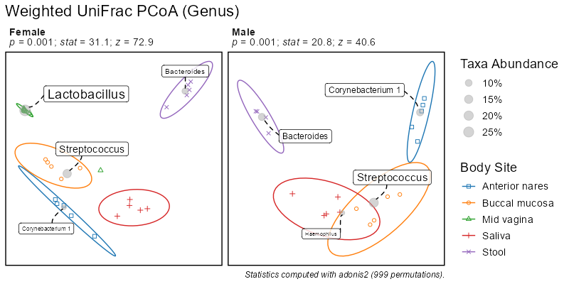
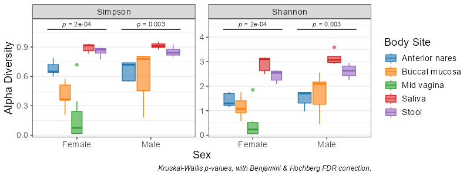
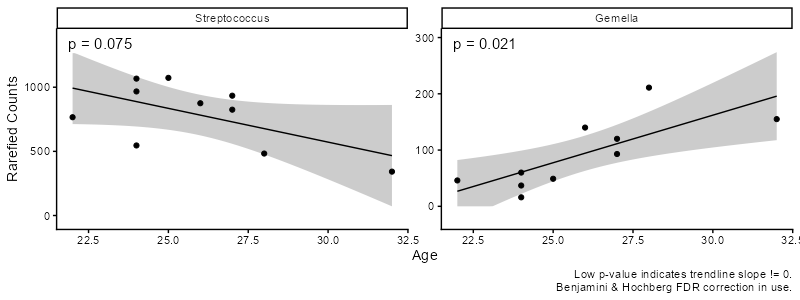
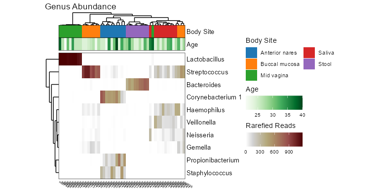
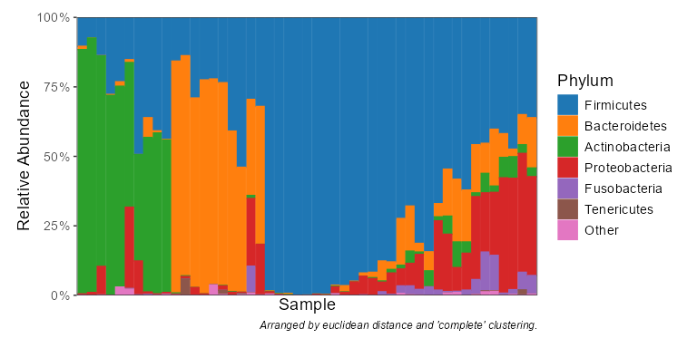

{height="150pt"}


# Summary

Microbes live all around us, on us, and even inside us. Their impacts can be as
personal as protecting or predisposing us to disease, or as global as regulating
planetary biogeochemical cycles. Modern DNA sequencing technology allows studies
to characterize thousands of microbial communities at a time. The bottleneck is
no longer generating data, but rather analyzing and interpreting the results.

Rbiom is an R package for analyzing microbial community datasets. Its features
include:

1. **Preprocessing** - Merges, subsets, and rarefies data from multiple sources.
2. **Calculation** - Diversity, similarity, and abundance metrics using fast C code.
3. **Statistics** - Identifies significant correlations with sample metadata.
4. **Visualization** - Customizable box plots, ordinations, heatmaps, and stacked bar charts.


# Statement of Need

Working with microbiome datasets is challenging. Analyses must integrate
observed counts, sample metadata, taxonomic mappings, and phylogenetic trees
into data structures compatible with statistical testing and visualization.
Rbiom makes it simple to turn these complex datasets into informative figures,
bringing together the speed of C with the powerful statistics and elegant
graphics of R.


# State of the Field

## Current Tools

@Wen:2023 provides an excellent review of R packages for microbiome analysis.
The list below includes those mentioned by Wen et al as and others that are
actively maintained.

**R Packages**

* ampvis2 [@ampvis2]
* animalcules [@animalcules]
* mia [@mia]
* microbiome [@microbiome]
* MicrobiomeAnalystR [@MicrobiomeAnalystR]
* MicrobiomeStat [@MicrobiomeStat]
* MicrobiotaProcess [@MicrobiotaProcess]
* Microeco [@microeco]
* microViz [@microViz]
* phyloseq [@phyloseq]
* phylosmith [@phylosmith]
* Tidytacos [@Tidytacos]
* vegan [@vegan]

**Command-line Tools**

* EasyAmplicon [@EasyAmplicon]
* mothur [@mothur]
* QIIME2 [@QIIME2]


## Advancement

Rbiom's speed and usability sets it apart from this crowd.


### Speed

The R packages listed above rely on GUniFrac [@GUniFrac], vegan, phyloseq,
and/or ampvis2 for calculating beta diversity metrics, namely bray-curtis,
euclidean, manhattan, jaccard, and UniFrac. The speed of these O(n^2^) operations
determines how many samples can be cross-compared in a feasible amount of time.
The exception is mia, which uses rbiom for UniFrac calculations.

Benchmarks show that rbiom calculates UniFrac dissimilarities 10 times faster
than GUniFrac, 50 times faster than phyloseq, and 400 times faster than
ampvis2[^1]. Additionally, rbiom calculates bray-curtis, euclidean,
manhattan, and jaccard metrics four times faster than vegan[^2].

rbiom has managed these improvements by implementing many central algorithms
in C and ensuring full utilization of multi-CPU core systems. This brings the
speed of rbiom in line with compiled tools such as mothur and QIIME2.


### Usability

`rbiom` can import data from a variety of sources - BIOM files, R data frames, phyloseq objects, and more. It can export to all these formats as well.


Pre-built binaries are available from CRAN and Anaconda, making installation easy on Windows, MacOS, and Linux. As much effort has been put into documentation as the code itself. Users will find that all functions are clearly documented with examples.


These programs offer a plethora of features and are fast even on large datasets, however, they come with a steep learning curve that may be discouraging to new users. Additionally, as command-line programs, it is cumbersome to interact with them from R.

`rbiom` sets itself apart from in two ways. First, it uses compiled C code to speed up calculations, thereby enabling processing of much larger datasets.


but it is the first to 

Several packages are currently available for working with microbiome datasets.

`QIIME2` [@QIIME2], `mothur` [@mothur], and `Phyloseq` [@phyloseq] offer
overlapping functionality with `rbiom`, but with important distinctions.
`QIIME2` and `mothur` are designed for command-line interaction, making them
difficult to integrate into R projects. `Phyloseq` has been a staple of R
bioinformatics for a decade, but is frustratingly slow for studies with
thousands of samples.


This package is designed for users of all experience levels. Novice R users
will appreciate that a couple commands will produce publication-ready figures.
Advanced R users can use `rbiom` to complement their existing pipelines with
faster and more flexible functions.


# Implementation

`rbiom` is an R package for working with abundance datasets, such as OTU or ASV 
counts from 16S amplicon sequencing. It enables importing/exporting all BIOM
formats, subsetting, rarefying, manipulation of metadata/taxonomy/phylogeny,
computation of alpha and beta diversity metrics, and summarizing counts per
taxonomic rank. Computationally intensive tasks (including UniFrac [@UniFrac]) 
have been implemented with multithreaded C to greatly reduce calculation 
time.

Visualization is a key component of `rbiom`. Rarefaction curves, taxa
abundances, alpha diversity, and beta diversity can all be plotted in a variety
of graphical formats, including correlation, heatmap, ordination, stacked bar,
and box plots. In `rbiom`, box plots can be any combination of box, bar, violin,
dot, strip, and/or range layers. Each plot includes provenance and modification
history as attributes, as well as the `ggplot2` [@ggplot2] call used to
render it to encourage downstream user customization.

Correlations between sample metadata and microbiome structure can be identified 
by mapping one or more metadata variables of interest to a plot's axes, facets, 
and/or aesthetics. These mappings can optionally define color/shape/pattern 
assignments, category ordering, or subsetting parameters. When metadata is 
associated with a axis or aesthetic, `rbiom` will automatically run the 
appropriate statistical test, correct for multiple comparisons, and display 
significant differences on the plot, captioning it with a brief methodology. 

Currently, `rbiom` can perform four types of significance testing. On 
correlation plots with a numeric metadata variable on the x-axis (e.g., Age, 
BMI), linear regression will be computed with R's `lm` linear model function.
For plots with two categories (e.g. Male vs Female), a Mann-Whitney test 
[@Mann:1947] is run with R's `wilcox.test`. When three or more categories are 
compared, the Kruskal-Wallis rank sum test [@Kruskal:1952] is used instead via 
R's `kruskal.test` function. P-values for ordinations are derived using the 
`adonis2` function from the `vegan` R package [@vegan], which randomly 
re-categorizes samples 1,000 times to estimate the significance of the observed 
clustering. P-values are corrected for multiple comparisons using the method 
described by [@Benjamini:1995] via R's `p.adjust` function to control for the 
false discovery rate. 


# Usage


### Installation

`rbiom` can be installed using R's default package manager.

``` r
install.packages('rbiom')
```

It can also be installed directly to a Conda environment.

``` bash
conda install conda-forge::r-rbiom
```


### Tutorials

Documentation and examples are available on the [`rbiom`
website](https://cmmr.github.io/rbiom/) and in R with:

``` r
help(package = 'rbiom')
```


### Example Analysis

Import the bundled `hmp50.bz2` biological observation matrix (BIOM) file.

``` r
library(rbiom)
infile <- system.file(package = "rbiom", "extdata", "hmp50.bz2")
biom   <- as_rbiom(infile)
biom
#> ══ Human Microbiome Project - 50 Sample Demo ══════
#> 
#> Oral, nasal, vaginal, and fecal samples from a
#> diverse set of healthy volunteers. Source: Human
#> Microbiome Project (<https://hmpdacc.org>).
#> 
#>      50 Samples: HMP01, HMP02, HMP03, ... 
#>     490 OTUs:    Unc01yki, Unc53100, ... 
#>       7 Ranks:   .otu, Kingdom, Phylum, ... 
#>       5 Fields:  .sample, Age, BMI, ... 
#>         Tree:    <present>
#> 
#> ── 182 - 22k reads/sample ─────────── 2023-09-22 ──
```

Rarefy abundance counts and explore associations with metadata..

``` r
biom <- rarefy(biom)
bdiv_ord_plot(biom, stat.by = "Body Site", facet.by = "Sex")
```



``` r
adiv_boxplot(biom, x = "Sex", adiv = c("otu", "shan"), stat.by = "Body Site")
```



``` r
subset(biom, `Body Site` == 'Buccal mucosa') %>% 
  taxa_corrplot("Age", taxa = 2, layers = 'ptc', fit = 'lm', test = 'emtrends')
```



``` r
taxa_heatmap(biom, taxa = 10, tracks = c("body", "age"))
```



``` r
taxa_stacked(biom, rank = "Phylum")
```




[^1]: Based on 100 replications of a 50-sample dataset (`rbiom::HMP50`) on six CPU cores.
[^2]: Based on 100 replications of a 1006-sample dataset (`rbiom::GEMS`) on six CPU cores.


# Acknowledgements

# References
