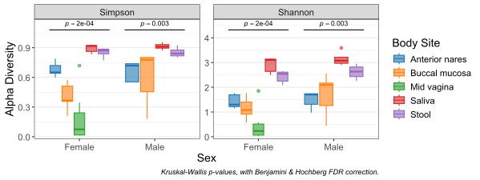

# Summary

`rbiom` is an R package that provides a comprehensive toolkit for the analysis
of microbiome and other ecological data. It is designed to streamline the entire
research workflow, from data ingestion and pre-processing to a wide range of
statistical analyses and the automated generation of publication-quality
figures. By integrating robust data management, diverse analytical methods, and
advanced visualization capabilities within a user-friendly framework, `rbiom`
provides an accessible platform for researchers—including those with limited
coding experience—to efficiently identify, interpret, and report significant
trends in complex sequencing-based datasets.


# Statement of Need

A core challenge in microbiome analysis is identifying meaningful associations
between a community's composition and its associated metadata. While established
packages like `phyloseq` [@phyloseq] provide a robust foundation for managing
complex datasets, a gap remains for a tool that unifies the entire analytical
pipeline in an accessible manner. The complexity of many existing tools can
present a significant barrier for researchers who are not computational experts.
`rbiom` addresses this need by providing a cohesive interface that connects
powerful data manipulation functions with automated, statistically-aware
visualizations, all supported by extensive documentation to lower the barrier to
entry. Its design prioritizes speed, reproducibility, and ease of use, making it
an effective tool for a wide range of users.


# Related Works

A recent review by @Wen2023 highlighted the vast number of R packages available
for microbiome analysis. While many of these tools offer statistical
capabilities, few integrate the full analytical workflow with automated
statistical visualization in a way that is accessible to novice users. The
foundational `phyloseq` package, for instance, lacks any built-in significance
testing. The closest peer to `rbiom` is `microeco`, which also integrates
statistical outputs into figures. `rbiom` builds upon this concept by offering a
more tightly integrated workflow and enhancing reproducibility. Key
differentiators include its ability to automatically position significance
brackets, print the statistical method on the plot, and, crucially, provide the
underlying R code used to generate both the figure and the statistics. This
transparent approach allows users to easily verify, customize, and learn from
the analyses.


# Functionality

The `rbiom` package offers a suite of functions covering the end-to-end analysis of microbiome data:

* **Data Ingestion and Management:** `rbiom` provides flexible data ingestion, supporting standard formats like BIOM files and outputs from popular pipelines such as `QIIME2` [@QIIME2] and `mothur` [@mothur]. For integration within the R ecosystem, it is fully interoperable with `phyloseq` and `SummarizedExperiment` objects. It provides a rich set of pre-processing tools for rarefaction, filtering, and taxonomic summarization.

* **Core Ecological and Statistical Analyses:** The package implements a wide range of standard analyses, including alpha diversity metrics, beta diversity distances, and statistical testing against metadata using methods like Kruskal-Wallis, PERMANOVA, and correlation analyses.

* **Automated Statistical Visualization:** A key feature of `rbiom` is its ability to directly translate statistical results into clear `ggplot2`-based visualizations [@ggplot2] with automated annotations for p-values, effect sizes, and model outputs.

* **Versatile and Customizable Plotting:** `rbiom` produces a diverse set of publication-ready graphics, including boxplots, heatmaps, stacked bar charts, and ordination plots, with extensive user control over aesthetics.

* **Comprehensive Documentation:** The package is supported by extensive online documentation, tutorials, and function references, available at <https://cmmr.github.io/rbiom/index.html>. This resource is designed to make the package's full functionality accessible to users at all levels of R proficiency and to facilitate a gentle learning curve.


# Example Figures

``` r
library(rbiom)
biom <- rarefy(hmp50) # hmp50 dataset is included with rbiom
bdiv_ord_plot(biom, bdiv = "UniFrac", stat.by = "Body Site", facet.by = "Sex")
```


``` r
adiv_boxplot(biom, x = "Sex", adiv = c("simp", "shan"), stat.by = "Body Site")
```




``` r
subset(biom, `Body Site` == 'Buccal mucosa') %>% 
  taxa_corrplot("Age", taxa = 2, layers = 'ptc', fit = 'lm', test = 'emtrends') +
  ggplot2::theme_classic()
```


# Conclusion

By unifying data management, diverse statistical analyses, and automated
visualization within an accessible framework, `rbiom` provides a powerful tool
for microbiome research. The package's focus on a reproducible, end-to-end
workflow, supported by comprehensive documentation, addresses a critical need in
the field. It lowers the barrier to entry for complex analyses, helping to
accelerate discovery and improve the reporting standards for ecological and
biological data science.


# Acknowledgements

This study was supported by NIH/NIAD (Grant number U19 AI144297), and Baylor
College of Medicine and Alkek Foundation Seed. The authors also acknowledge the
use of Google's Gemini for assistance in refining this manuscript.


# References
